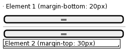
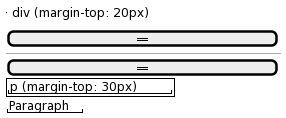

# Margin合并

**Margin合并**（或叫做**margin塌陷**）是一个在CSS中经常遇到的现象，特别是对初学者来说，可能会觉得这种行为非常的不直观，甚至觉得是一个bug。它通常发生在块级元素上，当两个垂直相邻的块级元素的外边距相遇时，它们会形成一个外边距。

Margin合并有以下几种情况：

### 1. 相邻兄弟元素的margin合并
当两个垂直相邻的兄弟元素之间，上面元素的下边距与下面元素的上边距相邻时，会形成一个外边距，大小为两者中较大的一个。



例如：
```html
<div style="margin-bottom: 20px;">Element 1</div>
<div style="margin-top: 30px;">Element 2</div>
```
这两个相邻的 `div` 之间的实际边距不是 50px，而是 30px。

### 2. 父元素与第一个/最后一个子元素的margin合并
如果一个父元素中没有边框和内边距，那么父元素的上边距会与其第一个子元素的上边距合并，下边距也会有类似的合并。



例如：
```html
<div style="margin-top: 20px;">
    <p style="margin-top: 30px;">Paragraph</p>
</div>
```
此时父 `div` 的上边距并非与 `p` 元素上方有20px的间距，而是与 `p` 元素上方有30px的间距。

### 3. 空块级元素的margin合并
空的块级元素（没有内容、没有边框、没有内边距的元素），上下外边距会合并。

例如：
```html
<div style="margin: 30px 0;"></div>
```
此 `div` 的上下外边距会合并为30px，而不是60px。

### 如何避免Margin合并？
一些常用的避免margin合并的技巧包括：
- 使用内边距（padding）代替外边距（margin）。
- 如果可能，为父元素添加最小的边框或内边距。
- 使用 `flexbox` 或 `grid` 布局。
- 使用 `overflow` 属性。
  

理解和解决margin合并问题能够帮助你更加精准地控制布局，避免一些不可预见的排版问题。