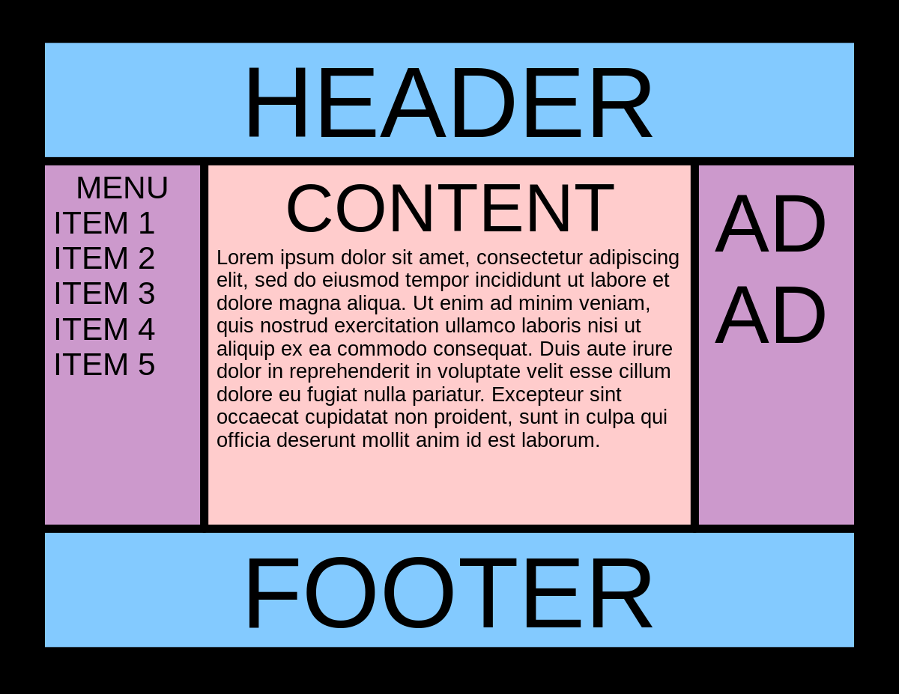

# 圣杯布局



**圣杯布局**（Holy Grail Layout）是一个经典的网页布局模式，特别是在较早的互联网发展时期，它被广泛讨论和使用。这种布局模型主要解决的问题是如何创建一个具有以下特征的稳定、灵活的网页结构：

1. **三栏布局**：具有两个侧边栏和一个主体部分。
2. **头部**：最上方有一个全宽的头部。
3. **页脚**：最下方有一个全宽的页脚。
   
此外，圣杯布局还有以下特性：
- **100%的主体高度**：主体部分可以延伸到视窗的整个高度，即使内容并未充满整个主体区域。
- **内容优先**：在CSS加载时，主体内容（通常是最重要的部分）首先加载，然后再加载两个侧边栏，优化了内容的获取和SEO。
- **自适应宽度**：两个侧边栏通常具有固定的宽度，而中间的主体部分是自适应的，可以根据浏览器窗口的大小进行变化。

这种布局在多年前尤其流行，因为它解决了许多在当时技术栈下困难的布局问题。然而，现代的CSS技术（例如Flexbox和Grid）已经使得实现这种布局变得相对简单和直接，所以这个话题现在可能不如过去那么常见了。

一个基础的圣杯布局的HTML结构可能是这样的：
```html
<div class="wrapper">
    <header>Header</header>
    <main>Main Content</main>
    <aside class="left">Left Sidebar</aside>
    <aside class="right">Right Sidebar</aside>
    <footer>Footer</footer>
</div>
```
过去实现圣杯布局涉及到复杂的CSS技巧，比如使用`float`属性、`position`属性和计算`margin`值等。现代实现可能会使用CSS Flexbox或Grid，可以更简洁地达到相同的效果，而且更易于理解和维护。