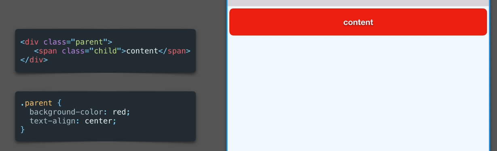
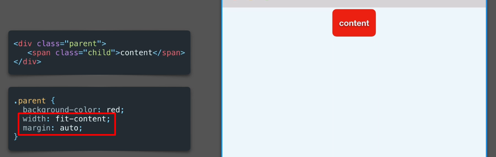
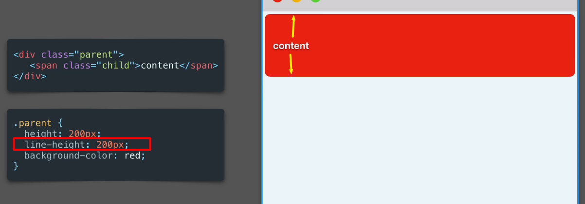
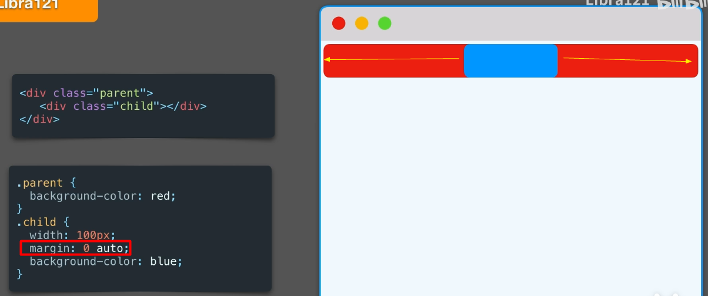
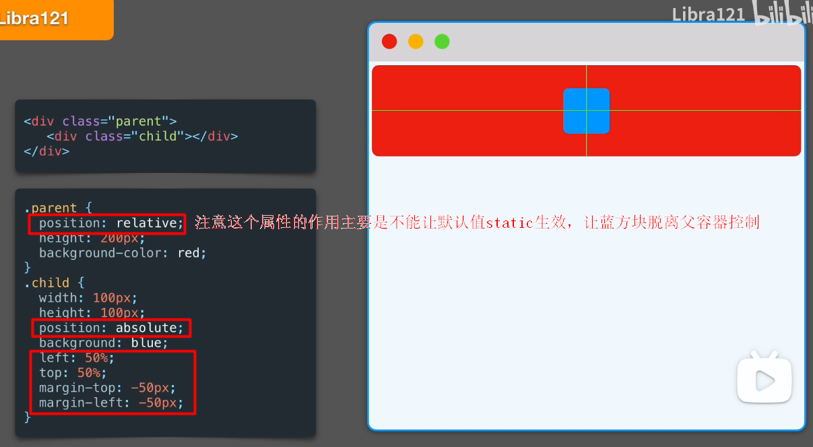
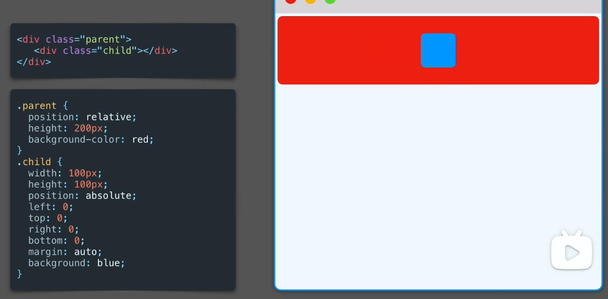
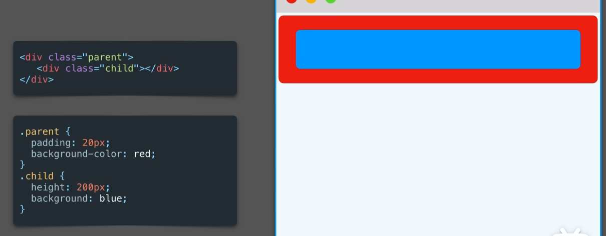
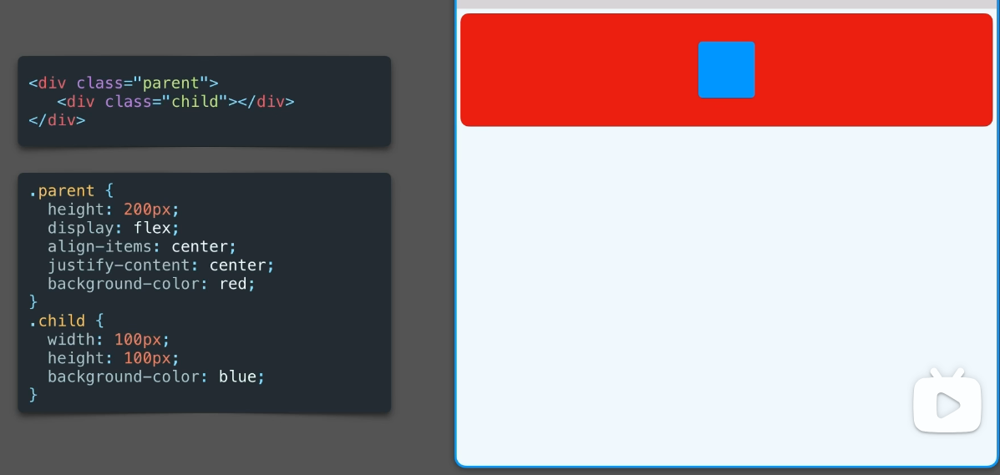
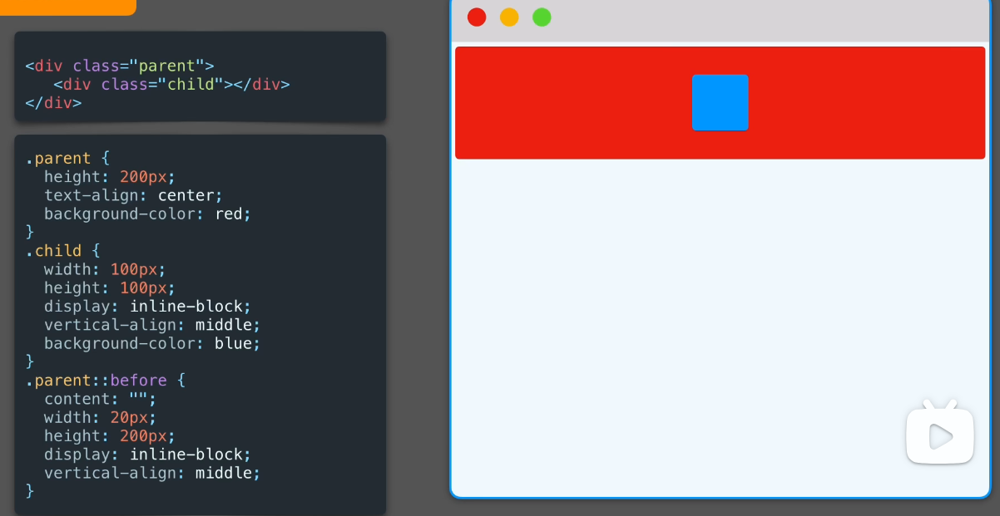
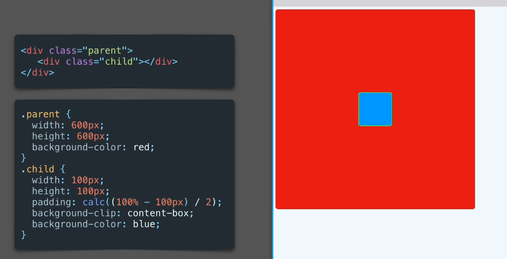

# 居中方案总结

## 行内元素-水平居中

### text-align: center;

注意这个属性是给文本容器或父容器用的，类似AndroidXML的gravity属性。

### fit-content

## 行内元素-垂直居中

### line-height(单行文本)

## 块级元素-水平居中

### margin: 0 auto;

## 块级元素-水平垂直居中

### 定位+margin固定值

#### 其它写法

### 定位+transform

上面这种写法的缺点是必须知道子元素的宽高才行，而transform没有这个问题。

### 定位+margin auto+上下左右

### Padding

### Flex

### 伪元素

### Calc

