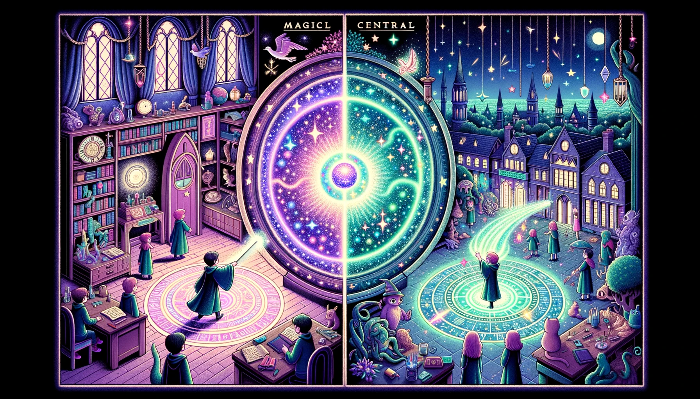

# Teleport

Vue 3 引入了一个非常有用的新特性，名为 `Teleport`。`Teleport` 是一个功能，**它允许你将子组件的模板渲染到 DOM 中的任何位置，而不仅仅是在父组件的模板中**。这在处理模态框、弹出窗口或者任何需要从 DOM 层级中“弹出”的组件时尤为有用。

### 基本原理

`Teleport` 能够将一个元素或组件的内容传输（或称为"teleport"）到一个在 DOM 中的其他位置。即使这个内容在 DOM 树的一个位置被渲染和创建，但它能在 DOM 的一个完全不同的位置被插入或移动。

### 基本用法

`Teleport` 在模板中的基本用法如下：

```html
<template>
  <div>
    <button @click="isModalOpen = true">Open Modal</button>
    
    <!-- 
    一个模态框组件是被定义在一个组件的模板里的，
    但通过使用 `<Teleport to="body">`，模态框的内容会被渲染到 `body` 元素内部。
    `to` 属性定义了我们想要传输内容到的目的地。 
    -->
    <Teleport to="body">
        <!-- 我们还用到了 `v-if` 来控制模态框是否被展示，
        这是因为 `Teleport` 组件自身不会影响它的内容是否被渲染 - 它只改变内容渲染的位置。 -->
      <div v-if="isModalOpen" class="modal">
        <p>Modal Content goes here</p>
        <button @click="isModalOpen = false">Close Modal</button>
      </div>
    </Teleport>
  </div>
</template>

<script>
export default {
  data() {
    return {
      isModalOpen: false
    }
  }
}
</script>
```

在这个简单的例子中，

### 使用场景

- **模态框**：你想要创建一个模态框，但是你想要保持模态框的代码和触发模态框的组件在同一个地方。
  
- **弹出菜单**：你想创建一个上下文菜单，它会在用户点击一个按钮的时候出现。

- **通知**：你想在页面的一个特定区域展示通知，即使通知的内容和状态是在组件树的另一个地方被定义和控制的。

通过 Teleport，Vue 3 提供了一种极其便捷的方法来处理这些在一个地方定义、在另一个地方渲染的常见用例，同时保持了逻辑的一致性和可追踪性。

## 🚀 魔法传送：神奇的Teleport！ 🌌

<div align=center></div>

### 🎭 场景 1：魔法学校

在一个辽阔的魔法学校中，每个小巫师都在忙着学习各种各样的魔法。他们在各自的教室中进行学习和实践，但每次他们想要展示他们的作品时，都需要带着它们跑到学校的中央广场上去。

_*解析：这里每个教室就像一个常规的组件。虽然组件（教室）拥有自己的上下文和作用域，但有时我们需要在组件外部的地方展示某些元素（学生的作品），例如在body中展示一个模态窗口。这就需要一个“传送”的机制。*_

```html
<template>
  <!-- 🎨 学生的作品 -->
  <div class="magical-item">
    <!-- 正常渲染在这个组件内部 -->
  </div>
</template>
```

### 🎇 场景 2：魔法传送

现在，小巫师们学到了一项新的魔法：传送！✨他们可以站在自己的教室里，轻轻挥动魔法棒，就将自己的作品传送到中央广场上，供所有人观赏。即使作品是在教室里制作的，但它能够出现在完全不同的地方，并且随时能被带回到教室。

_*解析：这就是Vue的Teleport做的事情！它允许我们将组件的一部分（例如模态窗口或通知）从逻辑上定义在一个组件内部，但在DOM的其他部分进行渲染，比如直接在body下。*_ 

```html
<template>
  <!-- 🚀 传送魔法作品到中央广场 -->
  <Teleport to="#central-square">
    <div class="magical-item" v-if="isShowing">
      <!-- 会在#central-square里渲染 -->
    </div>
  </Teleport>
</template>
```

### 🎉 场景 3：灵活的展示

小巫师们不仅可以轻松地将作品展示给大家，而且他们还能在作品在广场上展示的同时，在自己的教室里进行修改和调整，所有的变化都会实时地展现在广场上的作品中。🔄 这使得小巫师们可以更加灵活和自由地展示和分享他们的创造力。

_*解析：同理，当我们使用Teleport移动我们的DOM元素或组件时，虽然它们在DOM树的一个不同的位置被渲染，但它们的逻辑上下文（data、methods等）仍然保持在原组件中，可以保持数据响应式和逻辑一致性。*_ 

```html
<script>
export default {
  data() {
    return {
      isShowing: false,
      // 🎨 作品的数据和方法保持在这个组件的上下文中
    };
  },
  methods: {
    showMagic() {
      // 🪄 可以在这里进行作品的控制和逻辑处理
      this.isShowing = true;
    },
  },
};
</script>
```

借助这个小故事，希望你能理解Vue 3中Teleport的神奇之处和使用方法！🎩✨🚀