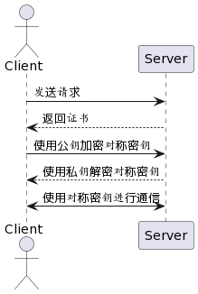
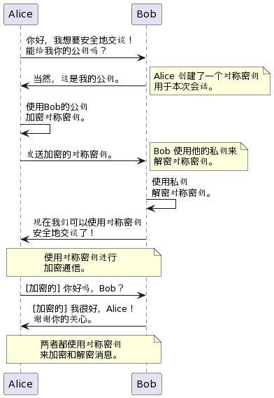

# HTTPS加解密过程

## 概述版

HTTPS使用公钥加密(客户端)和私钥解密(服务端)的方式进行加解密。
1. 客户端发送请求时，服务器返回证书，包含公钥。
2. 客户端使用公钥加密对称密钥，并发送给服务器。
3. 服务器使用私钥解密对称密钥，双方开始使用对称密钥进行通信，确保数据传输的机密性和完整性。

### 比喻法 - 🔐 **秘密的对话：安全通信的HTTPS**

👫 当Alice（客户端）与Bob（服务器）在喧嚣的集市（互联网）上对话，他们不希望旁人听到（数据泄露或被窃听）。Alice先要求Bob给她一个可公开的锁🔒（**公钥**）。然后Alice用这把锁将一个秘密箱子📦锁起来，只有Bob的私人钥匙🗝️（**私钥**）能打开它。箱子里有Alice专属的密语🗣️密码（**对称密钥**）。

当Bob打开箱子取出密语密码后，他们两人都能用这个密语密码来加密🔐和解密🔓他们的对话（数据），确保只有彼此能理解交谈内容，其他人即便听到，也无法理解这加密的密语，从而确保通信的隐秘性和安全性。

## 详述版

HTTPS就是在HTTP的基础上加入了SSL/TLS协议，用于加密HTTP的请求和响应过程。

下面是HTTPS的主要加解密（即SSL/TLS握手）过程的概括：

### 1. 建立SSL/TLS连接

#### a. 客户端发起请求
- 客户端（通常是一个网络浏览器）向服务器发送一个HTTPS请求，要求建立一个SSL/TLS连接。

#### b. 服务器响应
- 服务器向客户端发送其SSL/TLS证书，证书中包含了服务器的公钥和一些证书信息（如颁发机构、过期时间等）。

#### c. 客户端验证
- 客户端接收到证书后进行验证，检查证书的合法性。如果证书无效或过期，客户端通常会给用户一个警告。验证成功后，进程继续。

#### d. 生成预主秘钥
- 客户端生成一个预主秘钥（Pre-Master Secret），并使用服务器的公钥对其进行加密，然后将加密后的预主秘钥发送给服务器。

#### e. 生成会话秘钥
- 服务器使用自己的私钥解密获得预主秘钥，并在服务器和客户端之间建立起一个加密的通道。接下来，服务器和客户端都使用这个预主秘钥通过一定的算法生成会话秘钥（Session Key），用于之后的通信加密。

### 2. 加密的数据传输
- 之后客户端和服务器之间的所有通信都使用上述生成的会话秘钥进行加密，确保数据的机密性和完整性。

### 3. 关闭连接
- 数据传输完毕后，客户端和服务器协商断开连接。在下一次HTTPS通信时，通常会重复上述过程（除非在一个短时间内再次通信，可能重用会话秘钥）。

### 注意：
HTTPS协议不仅仅用于Web浏览器和Web服务器之间的通信，在任何客户端和服务器之间传输敏感数据的场景中都可能使用。TLS/SSL协议能确保在不安全的网络上传输数据的机密性和完整性，被广泛应用在各种网络通信安全场景中。