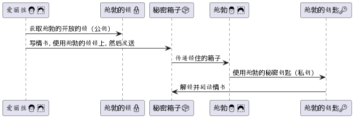

# RSA算法

## 概述版

RSA是一种非对称加密算法，使用公钥和私钥进行数据加密和解密。它基于大素数分解难题，用于实现加密通信和数字签名等安全功能。

### 比喻法 - 🔏 **双钥匙的秘密箱：神奇的RSA**

🗝️ **RSA算法**：你有一个特殊的箱子（数据），用两把不同的钥匙🔑可以打开。一把是公钥，你可以给任何人，他们用它将秘密（信息）锁进箱子（加密）。但要打开这个箱子，只有你持有的另一把专用钥匙——私钥🗝️能做到（解密）。即使别人有着加密用的公钥，也无法打开箱子拿到秘密。

这样，你的秘密信息可以安全地传达给你，无须担心途中被窃取。

## 详述版

**RSA** 是一种非常流行的非对称加密算法，由 Ron Rivest、Adi Shamir 和 Leonard Adleman 在1978年首次公开描述。在安全通信中，RSA通常被用于加密、解密、数据完整性验证以及数字签名等场景。

### 下面是一些关于RSA的关键点：

1. **非对称性**：RSA使用了一对密钥，即公钥和私钥。通常情况下，公钥是公开的，任何人都可以访问；私钥则是私有的，只有密钥的所有者才能访问。使用公钥加密的信息只能用相应的私钥解密，反之亦然。

2. **密钥产生**：RSA密钥的产生涉及到两个大质数的选择和一系列数学运算。其安全性部分基于大数因子分解的难度。

3. **密钥长度**：常用的RSA密钥长度包括1024位、2048位、3072位和4096位等。在当前的技术条件下，建议至少使用2048位长的密钥。

4. **用途广泛**：RSA被广泛用于SSL/TLS协议（保护网络传输数据的安全）和数字签名等。同时也常被用作其他加密算法（如AES）的密钥交换手段。

5. **性能**：相较于对称加密算法（如AES、DES），RSA要消耗更多的计算资源。因此，在实际的应用场景中，RSA经常与对称加密算法配合使用。

### 基本工作流程包括：

- **密钥生成**：选择两个大的质数，通过一系列的数学运算，生成公钥和私钥。
  
- **加密过程**：使用接收方的公钥对数据进行加密，结果只能由接收方的私钥解密。

- **解密过程**：使用私钥对收到的密文进行解密，获取原始数据。

- **数字签名**：发送方用私钥对数据生成签名，接收方用发送方的公钥验证签名的合法性。

RSA由于其基于数论的坚实数学基础和较高的安全性，在现代密码学和网络安全中扮演着极为重要的角色。

## 💌 情书的秘密：用古老的密码锁保护我们的信息 🗝

在一个古老的城堡中。爱丽丝👩‍🦰想要给鲍勃👨🏻‍🦱送一封私密的情书📜，确保只有鲍勃能读到它，但是路上的小偷🕵️很多，他们都想偷看情书的内容。

### 1. 🔐 鲍勃的神秘密码锁

鲍勃有一把特殊的密码锁🔒，任何人都可以用这把锁来锁住一个箱子，但只有用鲍勃的钥匙🔑才能打开它。

>_鲍勃的公钥（public key）就像这把任何人都可以用的密码锁。它可以被用来加密信息，但只有拥有与之配对的私钥（private key）的鲍勃才能解密这些信息。_

### 2. 📬 爱丽丝的特别邮递

爱丽丝用鲍勃的密码锁把她的情书锁在一个箱子里，并安全地发送给了他。因为只有鲍勃拥有唯一的钥匙，她知道只有他能打开它。

>_这里的箱子就像加密的信息。尽管小偷可能拦截到这个箱子，但由于他们没有私钥，所以他们无法打开它，也无法读到情书的内容。_

### 3. 💌 鲍勃的秘密解锁

当鲍勃收到箱子时，他用他的私人钥匙打开了它，并读到了爱丽丝的甜蜜话语。鲍勃的私人钥匙是不会与他的密码锁一起分享给任何人的，确保只有他能解锁箱子。

>_私钥需要保密，并且永远不应该与任何人分享。它是解密通过配对的公钥加密的信息的唯一方式。_

### 4. 🔄 回信的保护

如果鲍勃想要回信给爱丽丝，他将会用爱丽丝的公开密码锁来锁上回信的箱子。这样，在信息回到爱丽丝手中时，同样只有她能使用她的私人钥匙打开它。

>_通讯的双方都可以有自己的一套公钥和私钥。用对方的公钥加密信息可以保证，只有正确的接收者（因为只有他们有配对的私钥）能读取信息的实质内容。_

希望这个小故事能简化RSA加密的概念，并将其置于一个易于理解和记忆的上下文中！🏰💌🔐

## 数字签名

> 将数字签名理解为一种电子版的“防伪标志”是非常贴切的！

**数字签名**是一种加密技术，用于验证消息或文档的真实性、完整性，并确认发送者的身份。在很多方面，你可以将其视为防伪标志：

1. **真实性**：通过验证签名，可以确认消息确实是来自声称的发送者。
   
2. **完整性**：如果消息在传输过程中被篡改，签名将会失效，接收者能够检测到这一点。

3. **非否认性**：发送者不能否认消息的来源，因为只有他们拥有创建签名所需的私钥。

简单的流程大致如下：
- 发送者使用他们的**私钥**生成一条消息的签名。
- 接收者使用发送者的**公钥**验证签名。

如果签名验证成功，那么接收者可以确信：
- 消息确实来自声称的发送者（因为只有发送者拥有用于生成签名的私钥）。
- 消息没有在途中被篡改（因为任何修改都会导致签名不匹配）。

因此，数字签名不仅是防伪标志，还是一种保证消息真实性和完整性的机制。

### 📜 印章的魔法 ✨

爱丽丝👩‍🦰给她的信加上一个**唯一印章**🌹（**私钥**签名），证明信是她写的。任何人👥收到信后，用她公开的**透明笔**🖋️（**公钥**）检查印章，若发光✨则确认信来自她。虽然印章形状大家都知道，但只有她的印章能与透明笔配合产生特殊光芒🌟。