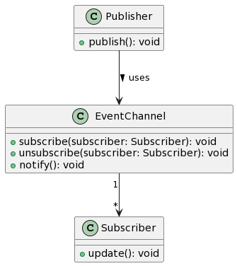

# 发布-订阅者模式

**发布-订阅者模式**是一种消息模式，**发布者**发送消息，但不需要知道哪些**订阅者**接收，订阅者可处理消息。

在发布-订阅模式中，通常涉及三种角色：

1. **发布者（Publisher）**
   - 发布者负责生成与广播消息或事件。发布者不需要知道谁是消息的接收者。

2. **订阅者（Subscriber）**
   - 订阅者关注或订阅自己感兴趣的消息或事件，并定义如何响应这些消息。订阅者不知道谁是消息的发布者。

3. **消息代理或事件通道（Message Broker/Event Channel）**
   - 消息代理或事件通道承担了在发布者和订阅者之间传递消息的角色。发布者发布消息到消息代理，然后消息代理将这些消息路由到对应的订阅者。



- `Publisher` 是发布者，它负责发送消息。
- `Subscriber` 是订阅者，它负责处理从`EventChannel`接收到的消息。
- `EventChannel` 是事件频道，它管理所有的订阅者，并在接收到发布者的消息时通知这些订阅者。

## 📢 喇叭广场：城市的消息中心 🏙️

<div align=center></div>

设想一个古老的城市中心，有一个大喇叭广场。在广场中央有一个大喇叭，任何人都可以用这个喇叭发布消息。城市里的居民如果想知道最新的消息，他们就会来到广场附近。当有人用大喇叭发布消息时，所有在广场的居民都能听到。

在这个比喻中:
- 📢 **大喇叭**代表**发布者**。
  > _它发送消息，但不知道哪些居民在听。_

- 🏙️ **居民**代表**订阅者**。
  > _他们来到广场，准备接收任何通过大喇叭发布的消息。_

- 🌳 **广场**代表**EventChannel**或消息中心。
  > _它是一个中心地带，连接发布者和订阅者，确保消息能够传递到每一个在场的居民。_

这个比喻帮助你理解发布-订阅者模式的核心概念：一个中心化的系统，使多个订阅者能够独立地从一个发布者那里接收消息，而发布者并不需要知道这些订阅者的存在。🎉

## 示例代码

```javascript
// 发布-订阅者模式 (Pub-Sub Pattern)

// ① 定义消息中心（Event Channel）
class EventChannel {
    constructor() {
        this.topics = {};
    }

    // 订阅消息
    subscribe(topic, listener) {
        if (!this.topics[topic]) {
            this.topics[topic] = [];
        }
        this.topics[topic].push(listener);
    }

    // 取消订阅
    unsubscribe(topic, listener) {
        if (!this.topics[topic]) return;
        this.topics[topic] = this.topics[topic].filter(l => l !== listener);
    }

    // 发布消息
    publish(topic, data) {
        if (!this.topics[topic]) return;
        this.topics[topic].forEach(listener => listener(data));
    }
}

// ② 定义发布者
class Publisher {
    constructor(eventChannel) {
        this.eventChannel = eventChannel;
    }

    // 发布新消息
    announceNews(news) {
        this.eventChannel.publish('NEWS_TOPIC', news);
    }
}

// ③ 定义订阅者
class Subscriber {
    constructor(name) {
        this.name = name;
    }

    listenNews(news) {
        console.log(`${this.name} 收到新闻: ${news}`);
    }
}

// 使用示例：

const newsChannel = new EventChannel();

const newsPublisher = new Publisher(newsChannel);

const alice = new Subscriber('Alice');
const bob = new Subscriber('Bob');

newsChannel.subscribe('NEWS_TOPIC', news => alice.listenNews(news));
newsChannel.subscribe('NEWS_TOPIC', news => bob.listenNews(news));

newsPublisher.announceNews("今天是个好日子！");

```

总结：发布-订阅者模式允许对象之间定义一种一对多的依赖关系，当一个对象的状态发生改变时，所有依赖于它的对象都会得到通知。这种模式为对象之间的松散耦合提供了一种简单的通信机制。

关键词：消息中心、发布者、订阅者、松散耦合、通知。

## 举例说明

发布-订阅模式广泛应用在多种技术平台和框架中，包括前端的 Vue.js 和移动平台的 Android。以下是一些具体的应用实例：

### 在 Vue.js 中：

1. **组件通讯**：
   - Vue.js 使用一个事件系统来允许组件之间的通讯，这在内部实际上就是一个发布-订阅模式。组件可以通过 `$emit` 来发布一个事件（发送消息），并通过 `$on` 来订阅一个事件（接收消息）。

2. **Vuex**：
   - 在 Vuex（Vue 的状态管理库）中，各个组件订阅了 store 的变化。当某一部分状态在 store 中发生变化时（发布），所有订阅了这一变化的组件（订阅者）都会得到更新。

3. **事件总线**：
   - Vue.js 的另一个常见用法是使用一个新的 Vue 实例作为事件总线。组件可以通过这个事件总线发布和订阅事件，从而实现非父子组件之间的通讯。

### 在 Android 中：

1. **EventBus 或 LiveData**：
   - 在 Android 开发中，EventBus 是一个流行的发布-订阅框架，允许组件之间解耦地通讯。组件（如 Activity、Fragment 等）可以发布事件，同时其他组件可以订阅这些事件，而不需要它们相互引用。
   - LiveData，来自 Android 架构组件，也可以看作一种发布-订阅机制。当数据发生变化时（发布），所有观察（订阅）该数据的组件会得到通知。

2. **LocalBroadcastManager**：
   - 使用 LocalBroadcastManager 发送应用内部的广播。组件可以发送广播（发布），同时其他组件可以注册相应的 BroadcastReceiver 来接收（订阅）这些广播。

3. **RxJava**：
   - RxJava（Reactive Extensions for the JVM）是一个在 JVM 上使用可观测的序列来组成异步的、基于事件的程序的库。它的核心模式也是发布-订阅模式，Observable（被观察者，发布者）发出的事件会被 Observer（观察者，订阅者）接收并作出响应。

在这些技术点中，发布-订阅模式都提供了一种在组件之间实现松耦合的通讯方式。这使得我们在构建应用时，可以更灵活地组织和扩展代码，提高代码的可维护性和复用性。

***

## 补充

   
### 工作流程：

1. **订阅消息**：订阅者告诉消息代理它对哪些消息感兴趣。
   
2. **发布消息**：发布者生成一个消息并将它发送给消息代理。
   
3. **消息代理的角色**：消息代理将接收到的消息转发给对这些消息感兴趣的订阅者。
   
4. **处理消息**：订阅者接收到消息后进行相应的处理。

### 优点：

- **解耦**：发布者和订阅者在逻辑上彼此独立，没有直接的依赖关系，从而实现了解耦。
  
- **扩展性**：新的订阅者或发布者可以轻松添加到系统中，不会影响已有的实现。
  
- **维护性**：由于系统的解耦，维护成本较低。

### 缺点：

- **复杂性**：随着订阅者数量的增加，管理订阅关系可能会变得复杂。
  
- **消息的实时性**：由于消息需要通过代理进行路由，可能存在一定的延迟。

发布-订阅模式常应用在多种技术场景中，例如消息队列技术、事件驱动架构、和实时通知等。比如 MQTT 协议，就是一个基于发布-订阅模式的物联网消息传输协议。

### 问题：
在计算机科学中，“发布-订阅者模式”是一种常见的设计模式。请描述该模式的主要特点和工作原理。

答案：
发布-订阅者模式（Publisher-Subscriber Pattern）是一种消息传递模式，其中发送消息的对象（发布者）不直接指定接收消息的对象（订阅者），而是将消息发送到一个中间组件或者频道。订阅者可以订阅这些频道以接收消息。当发布者发布一个消息时，所有订阅了该消息的订阅者都会收到这个消息。

主要特点：
1. 解耦：发布者和订阅者之间不存在直接依赖关系。
2. 动态性：订阅者可以在运行时动态地添加或删除。
3. 广播性：一个消息可以被多个订阅者接收。

工作原理：
1. 订阅者订阅特定的消息或频道。
2. 发布者发布消息到指定的频道。
3. 所有订阅了该频道的订阅者都会收到该消息。

