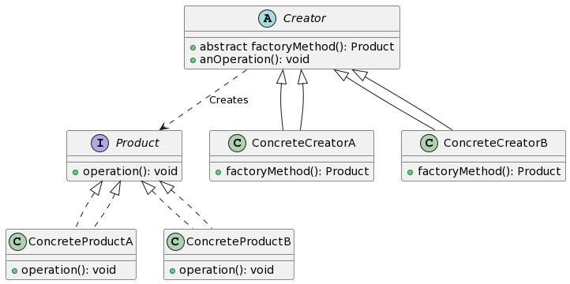

# 工厂模式

**工厂模式**是一种创建对象的设计模式，它使用一个**工厂类**来产生实例，而不是直接使用构造函数。



1. Product 是一个接口，代表工厂创建的产品。
2. ConcreteProductA 和 ConcreteProductB 是实现 Product 接口的具体产品。
3. Creator 是一个抽象工厂，定义了工厂方法 factoryMethod 用于创建产品。
4. ConcreteCreatorA 和 ConcreteCreatorB 是实现 Creator 的具体工厂，它们实现了 factoryMethod 来创建具体的产品。

## 🍔 快餐店的汉堡制作 🍟

想象你进入一个快餐店，想要一个汉堡。你不会直接去厨房制作一个，而是会告诉收银员你的选择，然后等待他们为你制作好。

在这里，快餐店就像一个**工厂**。你告诉它你想要的**产品类型**（例如，鸡肉汉堡或牛肉汉堡），然后它会为你**生产**这个产品。

- 🍔 **快餐店**就像是**工厂类**。
  > _它负责根据你的需求创建具体的产品。你不需要知道如何制作汉堡，只需知道如何从工厂（即快餐店）中请求它。_

- 📋 **菜单上的汉堡选项**就像是**产品接口**。
  > _这是你可以从工厂获得的产品种类的定义。_

- 🥩 **牛肉汉堡**或🐔 **鸡肉汉堡**就像是从**工厂方法**生产的**具体产品**。
  > _这些是工厂可以为你创建的具体产品。_

下次你去快餐店时，想想这个比喻，你会更加理解工厂模式的魅力！🌟

## 代码示例

```javascript
// 工厂模式 (Factory Pattern)

// ① 定义产品接口。这是工厂将生产的所有产品都要遵循的约定。
class Burger {
    eat() {
        throw new Error("此方法必须在子类中被重写");
    }
}

// ② 定义具体产品。这些是工厂能够创建的实际产品。
class ChickenBurger extends Burger {
    eat() {
        console.log("吃鸡肉汉堡");
    }
}

class BeefBurger extends Burger {
    eat() {
        console.log("吃牛肉汉堡");
    }
}

// ③ 定义工厂类。它提供一个方法来创建产品，但让子类决定实例化哪个类。
class BurgerFactory {
    createBurger(type) {
        switch (type) {
            case 'chicken':
                return new ChickenBurger();
            case 'beef':
                return new BeefBurger();
            default:
                throw new Error("未知的汉堡类型");
        }
    }
}

// 使用示例：

const factory = new BurgerFactory();

const chickenBurger = factory.createBurger('chicken');
chickenBurger.eat();  // 输出: 吃鸡肉汉堡

const beefBurger = factory.createBurger('beef');
beefBurger.eat();  // 输出: 吃牛肉汉堡

```

总结：工厂模式提供了一个接口来创建对象，但允许子类更改将要实例化的类。这种方式使代码的结构更加灵活、清晰，并有助于遵循单一职责原则，因为创建实例的逻辑被放在了工厂类中。

关键词：产品接口、具体产品、工厂类、创建方法。