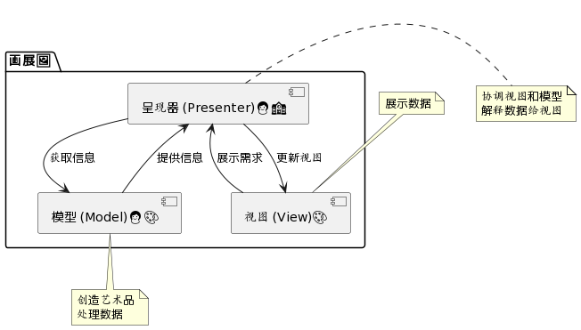

# MVP

## 概述版

MVP是一种软件架构模式，将应用程序分为模型（Model）、视图（View）和展示器（Presenter），通过Presenter处理业务逻辑，实现了数据、展示和逻辑的分离。

### 比喻法 - 🎨 **画展导览：探索MVP**

欢迎来到一场画展🖼️！  
- 模型（**Model**）就像艺术家👩‍🎨，创造精美的艺术品（数据处理）。
- 视图（**View**） 是展览的画作，展示艺术家的作品给大众看（用户界面）。
- 呈现器（**Presenter**） 是导游👩‍🏫，她理解观众的需求、指导他们通过展览并解释画作。

观众👥（用户）询问导游（呈现器）问题或表达兴趣，导游（呈现器）则向艺术家（模型）询问或点评画作，再将获取的信息回馈给观众（视图）。这一系列互动让展览体验变得丰富而引人入胜！🌟

## 详述版

**MVP**（Model-View-Presenter）是一种用于应用程序（尤其是图形用户界面）的设计和架构模式。MVP 是 MVC（Model-View-Controller）模式的一种衍生，专门用于改进 UI 层的构建。在 MVP 模式中，M、V、P 三个部分代表如下：

### 1. Model（模型）
- **职责**：处理数据的存储和检索，包括与数据库、文件系统或 API 交互。
- **特点**：Model 只负责数据相关的操作，不关心数据的展示和处理用户交互。
  
### 2. View（视图）
- **职责**：显示数据（模型提供的）并接收用户输入。视图通常直接从模型获取需要的数据或通过 Presenter 获取。
- **特点**：视图通常是被动的，只负责展示数据和接收用户输入，输入的处理通常交由 Presenter 来做。

### 3. Presenter（展示器）
- **职责**：作为 View 和 Model 之间的桥梁。监听模型数据的变化和视图用户的交互，并更新视图。
- **特点**：Presenter 包含与用户交互的业务逻辑，并负责读取数据从 Model 到 View。

### 工作流程
1. **用户交互**：用户与 View 层交互（例如点击按钮）。
2. **逻辑处理**：View 将用户的交互通知给 Presenter。Presenter 处理相关的业务逻辑。
3. **数据处理**：如果需要，Presenter 更新 Model 层的数据。
4. **数据展示**：Presenter 将最新的数据从 Model 获取并更新到 View，用户看到更新的数据。

### 特点
- MVP 将逻辑和 UI 分开，有助于提高代码的可测试性，因为 Presenter 可以脱离 UI 进行测试。
- View 层尽可能简单，不包含业务逻辑，专注于 UI 的展示。
- Presenter 持有 View 和 Model 的引用，但 View 与 Model 通常不直接通信。
  
MVP 模式主要应用在前端开发中，用于构建结构清晰、易于测试和维护的应用。它在某些具体的技术和框架中，如 Android App 开发和 .NET 框架中，被广泛使用。