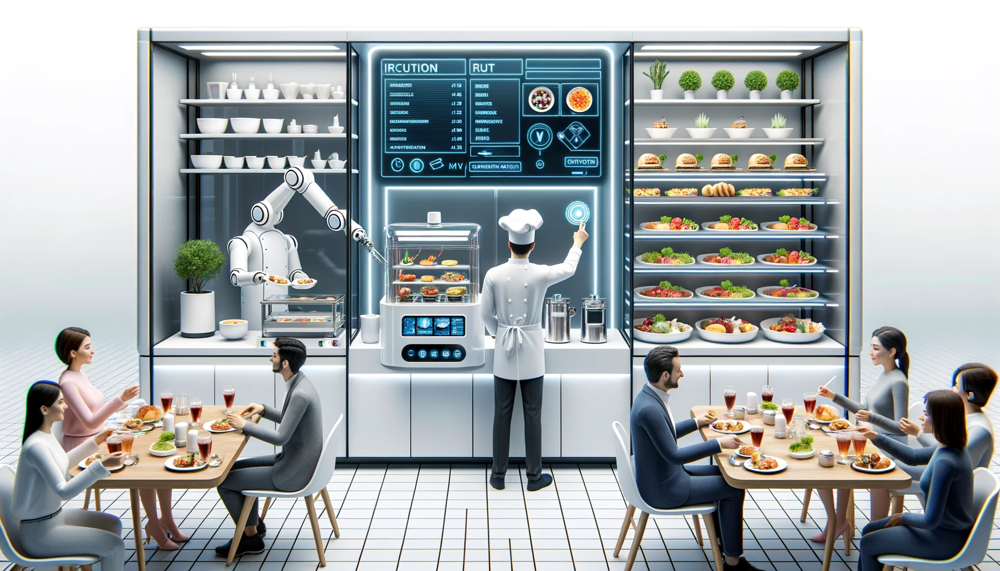

# MVVM

MVVM是**模型-视图-视图模型**（Model-View-ViewModel）的缩写，是一种**设计模式**。它将**数据模型**（Model）与**显示界面**（View）通过**视图模型**（ViewModel）进行双向绑定，实现数据和界面的**自动同步**，优化**分层**和**解耦**。

## 厨师、食材与美食展示：解读MVVM



想象一下你进入了一间先进的自动化餐厅，这里每一道美食（_视图 View_）的制作不再是传统的手工过程，而是通过一套特别的机制来呈现给食客。厨师（_ViewModel_）负责管理和准备食材（_Model_），但是他不直接把食物端到食客面前。

👨‍🍳 **厨师（ViewModel）**：
- 不直接和食客交流，而是通过一扇智能橱窗（_数据绑定 Data Binding_）来展示美食。
- 负责监听食客的需求（_事件 Event_），比如食客想要更加辣一些或者更加甜一些。
- 根据食客的需求，他调整食材的比例（_更新Model_），而橱窗里展示的美食也随之改变。

🍔 **食材（Model）**：
- 是制作美食的基础，可以是各种各样的原材料，比如牛肉、蔬菜等。
- 当食材发生变化时，比如牛肉变多了，这些变化会通知到厨师。

🖼️ **智能橱窗（View）**：
- 它会自动展示厨师制作的美食，不需要厨师亲自展示。
- 当食客有需求时（比如想点其他菜），可以通过一个按钮（_事件绑定 Event Binding_）来告知厨师。

_比喻解析_：
- _食材（Model）_：它就是我们APP的数据层，包含了应用中存储的原始信息。
- _智能橱窗（View）_：这相当于我们看到的UI界面，展示给用户看的东西，但是它并不处理任何逻辑，只是展示由ViewModel提供的数据。
- _厨师（ViewModel）_：它是一个中介者，负责处理逻辑事务。ViewModel监听Model的变化，并更新View，同时它也监听View的变化（比如用户的各种操作），并更新Model。

```javascript
// 伪代码表示
class Chef { // ViewModel
    listenToCustomer() { // 监听View的变化（例如，用户点击事件）
        //...
    }
    updateIngredients() { // 更新Model
        //...
    }
}

class Ingredients { // Model
    notifyChef() { // 当Model变化时，通知ViewModel
        //...
    }
}

class SmartShowcase { // View
    displayFood() { // 展示ViewModel提供的数据
        //...
    }
}
```