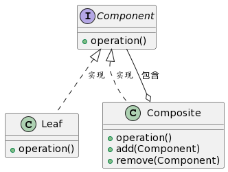

# 组合模式
组合模式允许将对象组合成**树形结构**以表示"**部分-整体**"的层次结构，使单个对象和组合对象具有统一的接口。



> 这个代码描述了组合模式的核心结构。
> 1. Component是一个接口，它有一个operation方法。
> 2. Leaf是该接口的简单实现，而Composite既实现了该接口，又有添加和删除子Component的能力。
> 这体现了组合模式的核心特点：使单个对象和组合对象具有统一的接口。

## 🌳 林中的树与叶 🍃

想象一个森林，它由许多树木组成。每棵树又由许多分支和叶片组成。在这里，整个森林就像一个大型组合，每棵树（包括其分支）是子组合，而叶片则是最基本的部分。

- 🌲 **每棵树**就像是**Composite**，它既可以有自己的特性（例如：生长、更改颜色），还可以有子元素（分支和叶片）。
  > _这就像组合中的“Composite”，它既有自己的操作，还可以包含其他Component（子组合或叶片）。_

- 🍃 **叶片**就像是**Leaf**，它是树的最基本部分，没有子元素，但仍然可以有它自己的特性（例如：光合作用）。
  > _这就像组合中的“Leaf”，它不包含其他Component，但它实现了Component接口，所以它有与Composite相同的操作。_

通过这种方式，无论我们正在处理整个森林、一棵树、一个分支还是一个叶片，都可以用相似的方式来处理它们！🌍

## 代码示例

```javascript
// 组合模式 (Composite Pattern)

// ① 定义组件接口。这是所有组件（叶子和复合）都要遵循的约定。
class Graphic {
    draw() {
        throw new Error("此方法必须在子类中被重写");
    }
}

// ② 定义叶子组件。这些是组合中的基本对象，它们没有子组件。
class Circle extends Graphic {
    draw() {
        console.log("绘制一个圆");
    }
}

class Square extends Graphic {
    draw() {
        console.log("绘制一个正方形");
    }
}

// ③ 定义复合组件。它们可以包含其他叶子或复合组件。
class CompositeGraphic extends Graphic {
    constructor() {
        super();
        this.graphics = [];  // 存储子组件的列表
    }

    draw() {
        // 绘制所有子组件
        for(let graphic of this.graphics) {
            graphic.draw();
        }
    }

    // 添加子组件
    add(graphic) {
        this.graphics.push(graphic);
    }

    // 移除子组件
    remove(graphic) {
        const index = this.graphics.indexOf(graphic);
        if (index > -1) {
            this.graphics.splice(index, 1);
        }
    }
}

// 使用示例：

const circle1 = new Circle();
const circle2 = new Circle();
const square = new Square();

const composite = new CompositeGraphic();
composite.add(circle1);
composite.add(circle2);
composite.add(square);

// 当调用复合组件的draw方法时，它会递归地调用所有子组件的draw方法
composite.draw();  // 输出: 绘制一个圆, 绘制一个圆, 绘制一个正方形

```

总结：组合模式允许你将对象组合成树形结构来表示"部分-整体"的层次结构。这样，客户端代码可以统一地对待单个对象和组合对象。在这个示例中，我们使用图形来演示组合模式，其中每个图形可以是一个单独的对象（如圆或正方形）或一个包含其他图形的组合。

关键词：组件、叶子、复合、"部分-整体"层次。