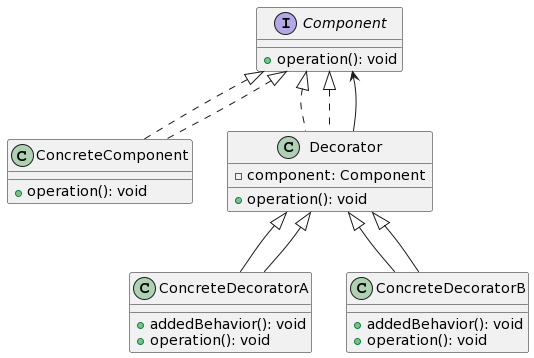
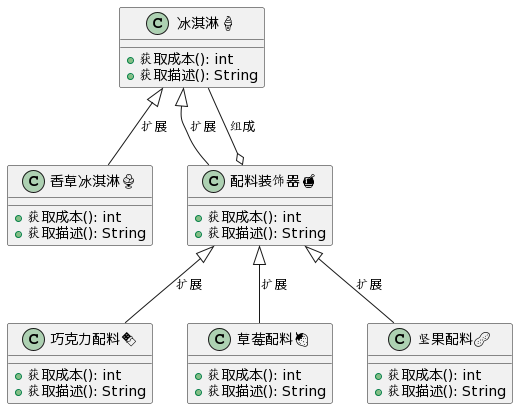

## 装饰器模式

**装饰器模式**允许在不修改其结构的前提下，**动态地**为对象添加**新的职责**。



- `Component` 是一个定义操作的接口。
- `ConcreteComponent` 是实现 `Component` 接口的具体对象。
- `Decorator` 是所有装饰器的基类，它包含一个 `Component` 类型的对象引用，这样它可以调用被装饰对象的操作。
- `ConcreteDecoratorA` 和 `ConcreteDecoratorB` 是实现 `Decorator` 的具体装饰器，它们可以为 `Component` 对象添加新的职责。

## 🍦 冰淇淋与其配料 🍫🍓🥜



想象你在冰淇淋店买了一个简单的香草冰淇淋。这已经很好吃了，但你可以选择添加巧克力酱、草莓或坚果来增强其味道。

在这里，**香草冰淇淋**是你的基本产品，而**巧克力酱、草莓和坚果**就像是装饰器，它们增加了额外的功能和特性。

- 🍦 **香草冰淇淋**代表**ConcreteComponent**。
  > _这是基本的对象，你可以只享受它，或选择添加一些额外的特性。_

- 🍫🍓🥜 **巧克力酱、草莓和坚果**代表**ConcreteDecorator**。
  > _它们为基本的香草冰淇淋添加了新的功能和特性，使其更加丰富和有趣。_

这个比喻帮助你理解装饰器模式的核心思想：动态地为对象添加功能，而不需要更改其原始结构。🌟

## 代码示例

```javascript
// 装饰器模式 (Decorator Pattern)

// ① 定义组件接口。这是所有组件（原始组件和装饰器）都要遵循的约定。
class IceCream {
    cost() {
        throw new Error("此方法必须在子类中被重写");
    }
}

// ② 定义原始组件。这是基本的组件，没有任何装饰。
class VanillaIceCream extends IceCream {
    cost() {
        return 10;  // 香草冰淇淋的价格
    }
}

// ③ 定义装饰器的基类。它包含一个 IceCream 类型的对象引用。
class IceCreamDecorator extends IceCream {
    constructor(iceCream) {
        super();
        this.iceCream = iceCream;
    }

    cost() {
        return this.iceCream.cost();
    }
}

// ④ 定义具体装饰器。它们为 IceCream 对象添加新的功能。
class ChocolateTopping extends IceCreamDecorator {
    cost() {
        return this.iceCream.cost() + 2;  // 添加巧克力酱的价格
    }
}

class StrawberryTopping extends IceCreamDecorator {
    cost() {
        return this.iceCream.cost() + 3;  // 添加草莓的价格
    }
}

// 使用示例：

const simpleIceCream = new VanillaIceCream();
const chocolateIceCream = new ChocolateTopping(simpleIceCream);
const doubleToppingIceCream = new StrawberryTopping(chocolateIceCream);

console.log(`香草冰淇淋的价格: ${simpleIceCream.cost()}`);  // 输出: 10
console.log(`加了巧克力酱的香草冰淇淋的价格: ${chocolateIceCream.cost()}`);  // 输出: 12
console.log(`加了巧克力酱和草莓的香草冰淇淋的价格: ${doubleToppingIceCream.cost()}`);  // 输出: 15

```

总结：装饰器模式允许你动态地为对象添加功能，而不是通过继承来实现。在这个示例中，我们使用了冰淇淋和其配料来展示如何使用装饰器模式，其中每个装饰器都可以为冰淇淋添加新的特性。

关键词：组件、原始组件、装饰器、动态添加功能。