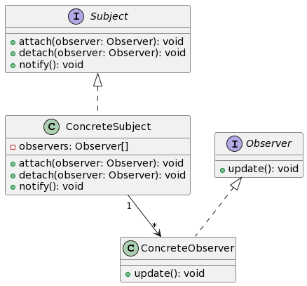
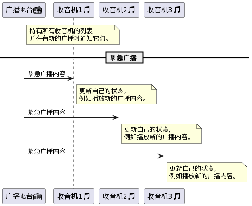
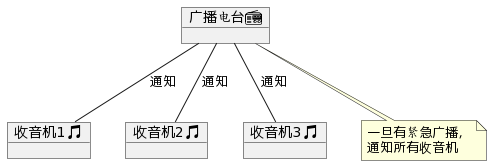

# 观察者模式（Observer Pattern）
用于建立一种一对多的依赖关系，让多个观察者对象同时监听某一个主题对象。当主题对象状态变化时，所有依赖于它的对象都会得到通知并自动更新。

观察者模式主要包含两类对象：主题（Subject）和观察者（Observer）。


- `Subject` 是主题接口，它定义了添加、移除和通知观察者的方法。
- `Observer` 是观察者接口，它定义了一个更新方法，当主题状态改变时会被调用。
- `ConcreteSubject` 是具体的主题，它实现了 `Subject` 接口并持有观察者的列表。
- `ConcreteObserver` 是具体的观察者，它实现了 `Observer` 接口，并在被通知时执行一些操作。

## 📻 广播电台和收音机：信息的传递与接收 🎵



想象一下，有一个广播电台正在播放音乐和新闻。当你打开你的收音机，你可以选择频道并收听这些广播。当电台有重要的紧急广播时，所有 tuned in 的收音机都会收到这个信息。

在这里，**广播电台**就像是观察者模式中的**主题**，而每一个**收音机**则代表一个**观察者**。

- 📻 **广播电台**代表**Subject**。
  > _它持有所有收音机的列表，并在有新的广播时通知它们。_

- 🎵 **收音机**代表**Observer**。
  > _当收到来自广播电台的通知时，它会更新自己的状态，例如播放新的广播内容。_

这个比喻帮助你理解观察者模式的核心思想：一个主题和多个观察者之间的一对多的依赖关系，当主题的状态发生变化时，所有依赖于它的观察者都会被通知并自动更新。🌟



## 示例代码

```javascript
// 观察者模式 (Observer Pattern)

// ① 定义观察者接口
class Observer {
    update(message) {
        throw new Error("此方法必须在子类中被重写");
    }
}

// ② 定义主题接口
class Subject {
    constructor() {
        this.observers = [];
    }

    addObserver(observer) {
        this.observers.push(observer);
    }

    removeObserver(observer) {
        const index = this.observers.indexOf(observer);
        if (index !== -1) {
            this.observers.splice(index, 1);
        }
    }

    notify(message) {
        for (const observer of this.observers) {
            observer.update(message);
        }
    }
}

// ③ 定义具体的主题：广播电台
class RadioStation extends Subject {
    broadcastNews(news) {
        this.notify(`📻 广播新闻: ${news}`);
    }
}

// ④ 定义具体的观察者：收音机
class Radio extends Observer {
    update(message) {
        console.log(`收音机播放: ${message}`);
    }
}

// 使用示例：

const radioStation = new RadioStation();
const radio1 = new Radio();
const radio2 = new Radio();

radioStation.addObserver(radio1);
radioStation.addObserver(radio2);

radioStation.broadcastNews("今天是个好日子！");

```

总结：观察者模式定义了对象之间的一对多依赖，这样当一个对象改变状态时，它的所有依赖者都会被通知并自动更新。在本示例中，广播电台作为主题，当它有新的广播时，所有注册的收音机（观察者）都会收到通知并播放广播。

关键词：主题、观察者、一对多依赖、自动通知。

***

## 补充

### 主要角色：

1. **主题（Subject）**：
   - 主题通常持有一个观察者列表，用于存储所有注册的观察者对象。
   - 提供方法允许观察者注册和注销。
   - 当主题的状态发生变化时，通知所有的观察者。

2. **观察者（Observer）**：
   - 通常提供一个更新方法（update()），用于在得到主题通知时更新自己。
   - 观察者通过主题提供的注册方法订阅主题的更新。

### 工作过程：

- 观察者将自己注册到主题上，表示它对主题的兴趣。
- 当主题状态变化时，它会通知所有注册在它上面的观察者。
- 观察者在接收到通知后，通过调用自己的更新方法（或类似的操作）来获取最新的状态。

### 示例：

一个简单的例子是，想象一个新闻发布平台（主题）和多个订阅者（观察者）。订阅者订阅新闻，当新闻发布平台发布新的新闻时，所有订阅了新闻的订阅者都会接收到通知。

### 特点：

- **优点**：主题和观察者之间的依赖是抽象的，实现了对象之间的松耦合。
- **缺点**：在某些情况下，可能会引发效率问题，比如当观察者太多或者通知的操作太复杂时。

### 在编程中的应用：

观察者模式在很多编程场景中都得到了应用，例如：
- GUI 编程中，监听用户输入或用户行为。
- 监听系统状态的变化。
- 在实现模型-视图-控制器（MVC）架构时。

### 和发布-订阅模式的区别：

虽然观察者模式和发布-订阅模式在逻辑上有很多相似之处，但两者还是有一些区别的。最主要的区别在于，在发布-订阅模式中，发布者和订阅者之间通常会有一个消息代理或事件通道，而在观察者模式中，主题和观察者通常会直接进行交互。