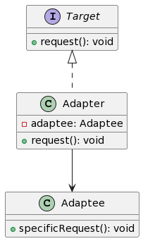

# 适配器模式

**适配器模式**允许**不兼容的接口**能够**一起工作**，通过一个中间适配器进行转换。



- `Target` 是客户端期望的接口。
- `Adaptee` 是需要被适配的类，它有一个 `specificRequest` 方法，但它与 `Target` 接口不兼容。
- `Adapter` 是适配器类，它实现了 `Target` 接口，并内部包含一个 `Adaptee` 的引用。当调用 `Adapter` 的 `request` 方法时，它会转调 `Adaptee` 的 `specificRequest` 方法。

## 🔌 电源适配器：连接世界的桥梁 🌍

想象你从美国旅行到欧洲，带着一个美式插头的充电器。但在欧洲，墙上的插座和美国不同。这时，你需要一个**电源适配器**，将美式插头转换为欧式插头，使充电器能够正常工作。

在这里，**电源适配器**就是我们的适配器模式的代表。

- 🔌 **电源适配器**代表**Adapter**。
  > _它提供了一个中间层，允许两个原本不兼容的接口（美式插头和欧式插座）能够一起工作。_

这个比喻帮助你理解适配器模式的核心思想：在不改变已有代码的前提下，使原本不兼容的接口能够协同工作。🌟

## 示例代码

```javascript
// 适配器模式 (Adapter Pattern)

// ① 定义目标接口。这是客户端期望的接口。
class Target {
    request() {
        throw new Error("此方法必须在子类中被重写");
    }
}

// ② 定义被适配者。它有一个特定的请求方法，但与目标接口不兼容。
class Adaptee {
    specificRequest() {
        return "这是一个特定的请求";
    }
}

// ③ 定义适配器。它实现了目标接口，并内部包含一个被适配者的引用。
class Adapter extends Target {
    constructor(adaptee) {
        super();
        this.adaptee = adaptee;
    }

    request() {
        return this.adaptee.specificRequest();
    }
}

// 使用示例：

const adaptee = new Adaptee();
const adapter = new Adapter(adaptee);

console.log(adapter.request());  // 输出: 这是一个特定的请求

```

总结：适配器模式提供了一个桥梁，使原本接口不兼容的对象能够协同工作。在这个示例中，我们展示了如何使用适配器模式将一个特定的请求适配为客户端期望的请求。

关键词：适配器、目标接口、被适配者。

