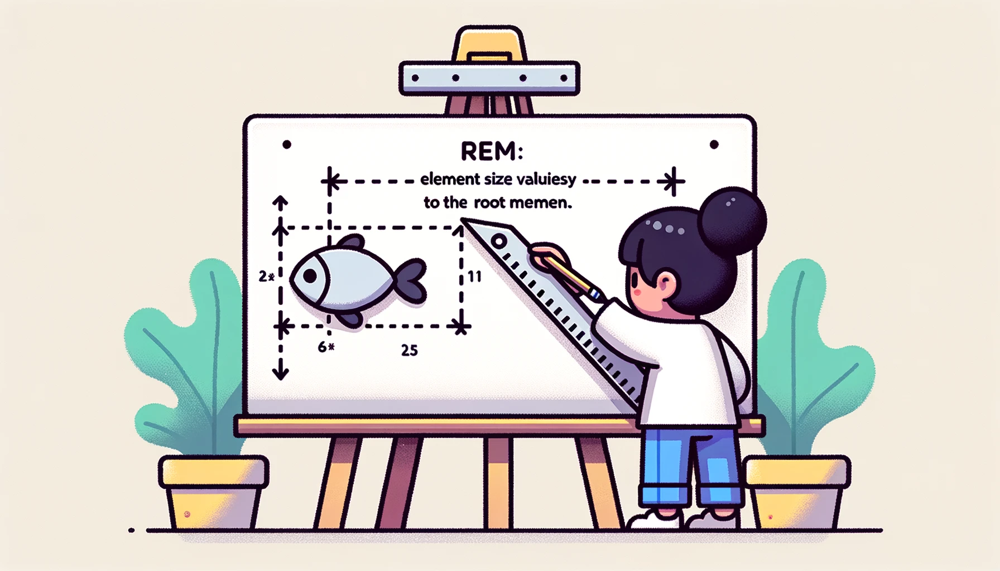

## 🎨 画家与他的画布

<div align=center></div>

想象一下：一个画家👩‍🎨站在一面固定大小的画布🎨前。她可以选择用精确的长度单位（如厘米）来测量和绘制画面。与此同时，她也有一种特殊的尺子📏，该尺子的长度可以在不同的画布上变化，使得在更大或更小的画布上创作时，她能保持相同的设计比例和美感。

### 🖼️ px (像素点)
画家用标准尺子测量出确切的距离，并用此准确画出图形。

*_*像素(px)是一个固定的长度单位，不会因元素或页面的大小变化而变化。在任何设备或屏幕上，一个像素总是一个像素，为绝对单位。*_* 

例如：
```css
font-size: 16px;
```

### 📐 em
画家发现，如果她画的是一副包含父子关系的图（比如大鱼🐟嘴里含着小鱼🐟），小鱼的大小和大鱼的大小有一定的比例关系。

*_*`em`是相对单位，它的大小是相对于其父级元素字体大小的。也就是说，1em等于父级元素的字体大小，如果父级元素字体大小变化，以em为单位的子元素大小也会随之变化。*_* 

例如：
```css
/* 父级元素 */
.parent {
  font-size: 20px;
}

/* 子元素 */
.child {
  font-size: 1.5em;  /* 等于 30px */
}
```

### 🧮 rem
此外，画家也有一个特殊的尺子，无论画布大小如何，该尺子的基础刻度都保持一致，即以画布的一小部分（例如画布宽度的1/16）作为基础单位。

*_*`rem`是相对于根元素（HTML元素）字体大小的相对单位。无论在文档的何处，1rem总是等于根元素的字体大小。*_* 

例如：
```css
/* 根元素 */
html {
  font-size: 16px;
}

/* 任意元素 */
.element {
  font-size: 2rem;  /* 等于 32px */
}
```

通过这三者的组合和运用，画家（设计者/开发者）能在不同大小的画布（屏幕/设备）上，用固定像素绘制精确图形，用`em`控制相关元素的相对大小，以及用`rem`保持整体的设计比例和美感。