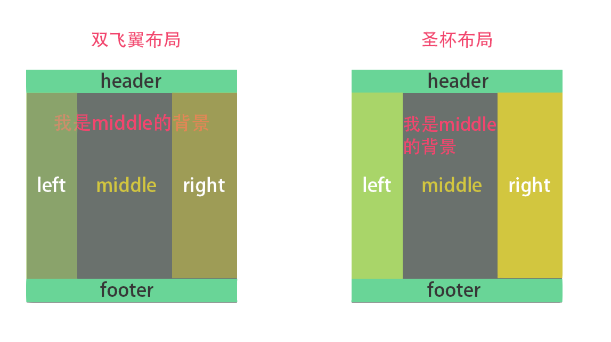

# 双飞翼布局



**双飞翼布局**（Double-wing Layout）是一种流行的网页布局模型，它与**圣杯布局**有很多相似之处。主要的不同在于双飞翼布局的实现方式和结构化方法不同，特别是在样式表的实现上。双飞翼布局也是一种三栏布局模型，由一个宽度自适应的主体部分和两个侧边栏组成。

### 基础结构
这种布局通常包含以下几个主要部分：
- 一个全宽的头部
- 一个自适应的中心主体列
- 两个固定宽度的侧边栏
- 一个全宽的页脚

### HTML 结构示例
```html
<div class="container">
    <div class="main">Main Content</div>
</div>
<div class="side side-left">Left Sidebar</div>
<div class="side side-right">Right Sidebar</div>
```

### 基础特性
- **主体内容优先加载**：这有利于SEO和提高用户体验。
- **主体内容宽度自适应**：当浏览器窗口大小变化时，主体内容的宽度能够自动调整。
- **侧边栏宽度固定**：两边的侧栏通常宽度固定，不随浏览器窗口变化。

### CSS 实现
双飞翼布局的一个典型特点是通过CSS的`margin`属性来控制中心列和侧边栏的位置。这是一个简化的CSS示例，仅用于演示双飞翼布局的基本实现方式：
```css
.container {
    width: 100%;
}
.main {
    width: 100%;
    margin-left: [Left Sidebar Width];
    margin-right: [Right Sidebar Width];
}
.side-left {
    float: left;
    width: [Left Sidebar Width];
    margin-left: -100%;
}
.side-right {
    float: left;
    width: [Right Sidebar Width];
    margin-left: -[Right Sidebar Width];
}
```
上述示例代码中，左右侧边栏通过浮动定位，而主体部分通过`margin`属性调整它的位置，使得主体部分能在视觉上位于中间。

### 小结
双飞翼布局在早期的网页设计中相当流行，由于其结构清晰，容易适应不同的屏幕和设备，因此经常被用于实现响应式设计。与圣杯布局类似，现代的CSS技术（如Flexbox和Grid）提供了更为简洁和强大的解决方案来实现这种布局，使得实现这种布局变得更加直观和简单。