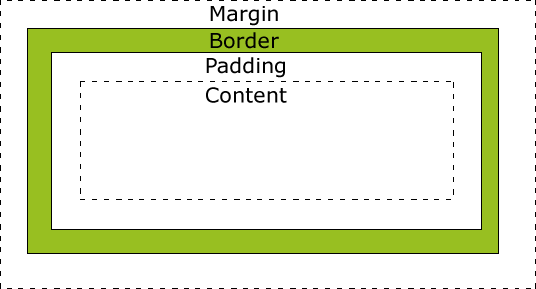

# 盒模型

盒模型（Box Model）是CSS中的一个核心概念，它**描述了元素在页面上如何被渲染和布局**。每个HTML元素都可以看作是一个矩形的"盒子"，并且这个"盒子"有几个主要的组成部分。



以下是盒模型的主要组成部分：

1. **内容（Content）**：
   - 这是元素的实际内容，例如文本、图片或其他元素。它的尺寸可以通过`width`和`height`属性来设置。

2. **内边距（Padding）**：
   - 内边距是内容与边框之间的空间。它在内容的外部，但在边框的内部。
   - 你可以使用`padding-top`, `padding-right`, `padding-bottom`, `padding-left`或简写属性`padding`来设置它。

3. **边框（Border）**：
   - 这是围绕内容和内边距的可见或不可见的线。边框的尺寸、样式和颜色都可以设置。
   - 使用`border-width`, `border-style`, `border-color`或简写属性`border`来定义。

4. **外边距（Margin）**：
   - 外边距是元素与其他元素之间的空间。它位于边框的外部。
   - 使用`margin-top`, `margin-right`, `margin-bottom`, `margin-left`或简写属性`margin`来设置。

**盒模型的重要性**：

- 盒模型是布局的基石。了解盒模型如何工作对于创建布局、调整间距和解决布局问题非常有帮助。
- 当你设置一个元素的`width`和`height`时，你实际上只是设置了内容的尺寸。整个元素的实际空间还包括内边距、边框和外边距。

**盒模型的模式**：

- 在CSS中，有两种盒模型的解释模式：标准模式（默认）和`box-sizing`属性的`border-box`值。
- 在标准模式中，元素的`width`和`height`只设置内容的大小。
- 使用`box-sizing: border-box;`时，元素的`width`和`height`会包括内容、内边距和边框（但不包括外边距）。

了解盒模型是CSS中的基础知识，它对于布局和样式的实现至关重要。

***

## content-box和border-box的区别是什么？

在 CSS 中，`box-sizing` 属性用于更改默认 CSS 盒模型的计算方式。它主要有两个值：`content-box` 和 `border-box`，它们决定了元素的宽度和高度如何被计算。

### content-box
当 `box-sizing` 属性被设置为 `content-box` 时，元素的宽度和高度只包含内容的宽度和高度，不包括边框（border）、内边距（padding）、外边距（margin）。

计算方式是：
\[ 元素总宽度 = 内容宽度 + 左右padding + 左右border + 左右margin \]
\[ 元素总高度 = 内容高度 + 上下padding + 上下border + 上下margin \]

### border-box
当 `box-sizing` 属性被设置为 `border-box` 时，元素的宽度和高度包括内容、内边距和边框，但不包括外边距。

计算方式是：
\[ 元素总宽度 = 内容宽度 + 左右padding + 左右border \]
\[ 元素总高度 = 内容高度 + 上下padding + 上下border \]

这样的设定通常会使布局的计算更为直观和简单，因为你设置的宽度和高度值就是元素盒子模型的实际宽度和高度。

### 示例
```css
/* 使用content-box */
.element1 {
    box-sizing: content-box;
    width: 200px;
    border: 10px solid black;
    padding: 20px;
    /* 实际占用的空间宽度 = 200px (内容) + 2*10px (边框) + 2*20px (内边距) = 260px */
}

/* 使用border-box */
.element2 {
    box-sizing: border-box;
    width: 200px;
    border: 10px solid black;
    padding: 20px;
    /* 实际占用的空间宽度 = 200px (内容 + 边框 + 内边距) */
}
```

在实际开发中，许多开发者会选择使用 `border-box` 作为全局设置，以简化布局的计算。
```css
* {
    box-sizing: border-box;
}
```