# CSS小技巧

## background-repeat: round;

### 需求

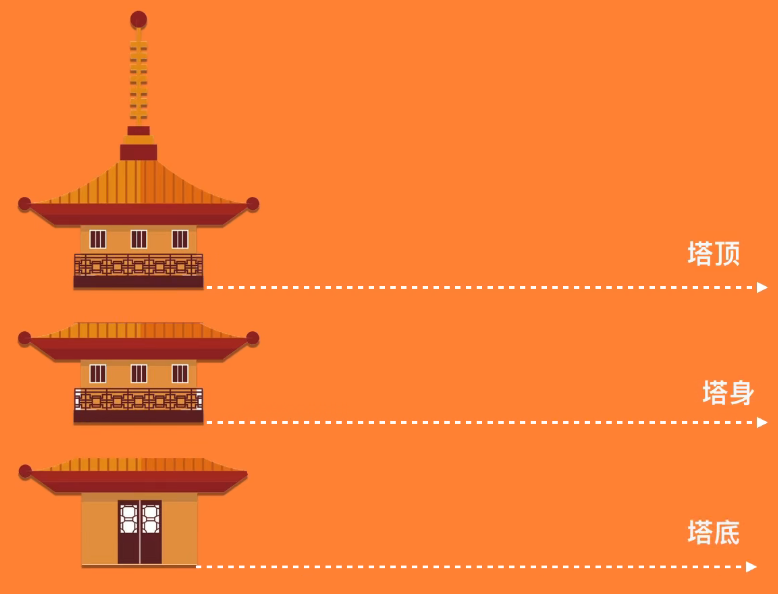

### 使用background-repeat

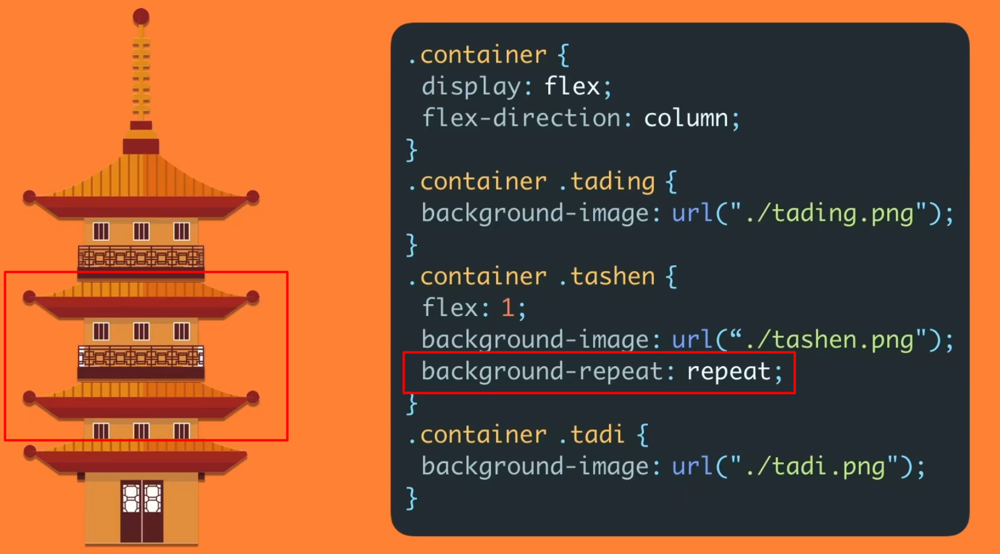

第二个塔身被裁剪了
 

### 使用background-round

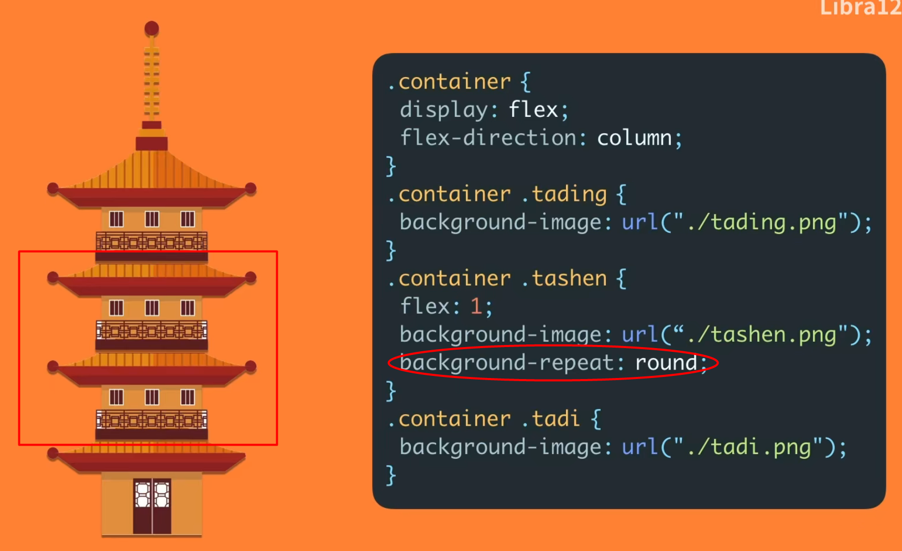

两个塔身将被拉伸，以适应高度
 

## prefers-color-scheme

这个属性用于检测用户是否有将系统的主题色设置为亮色或者暗色

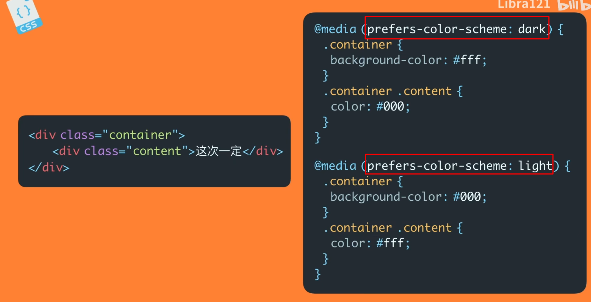

## ::selection &::first-letter

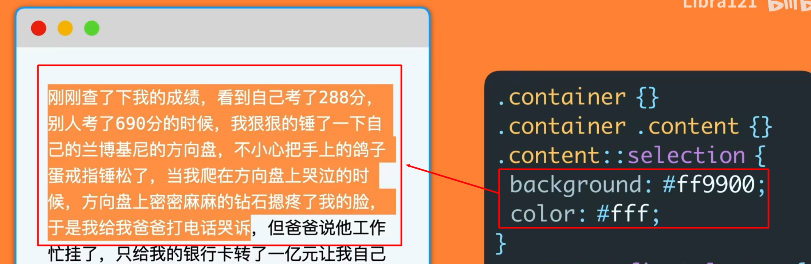

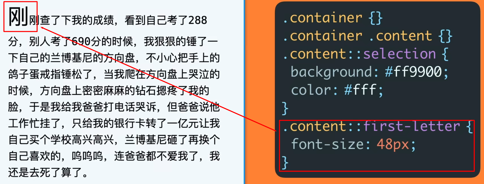

## Text Gradient

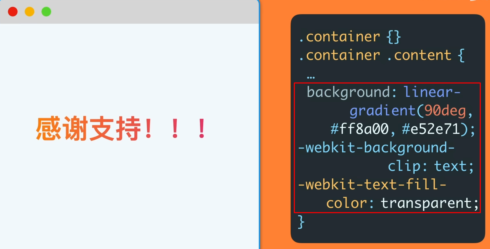

## filter: grayscale(100%);

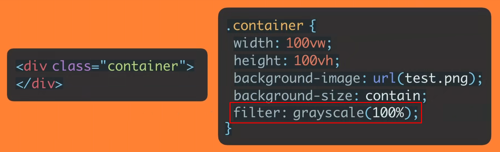

## Pointer-event

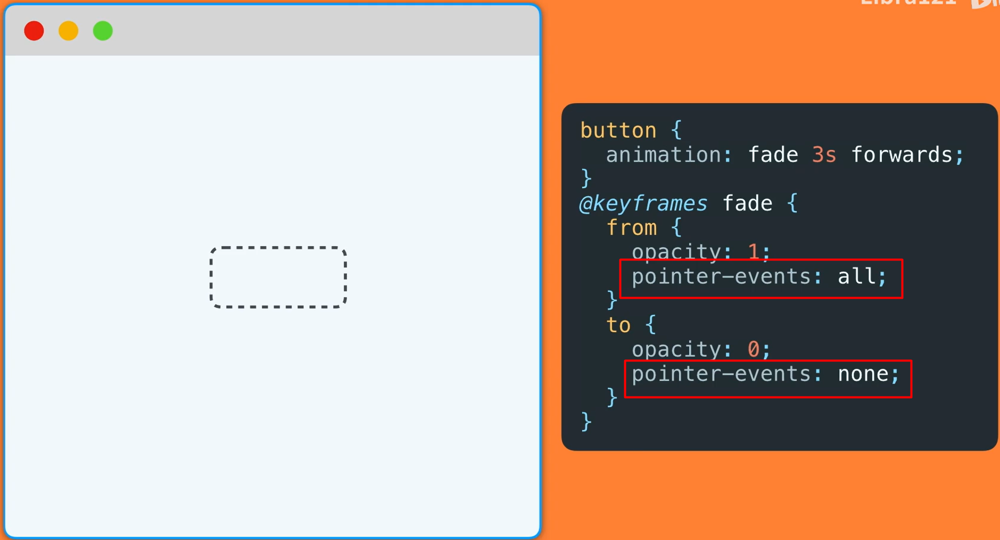

使用Pointer-event的none去除鼠标点击事件和hover效果。

## Blend modes

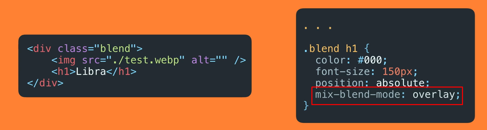

## Shape outside

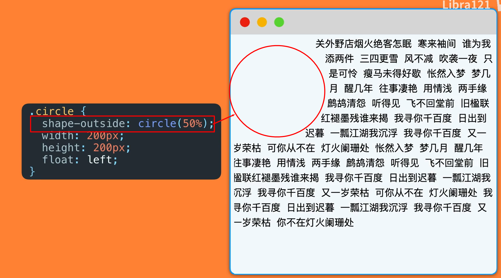

## Style Broken Images

### 默认破损图效果

### 新图覆盖旧图

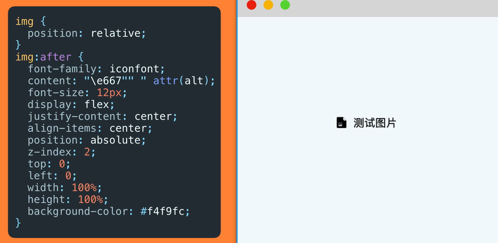

### Gradient border

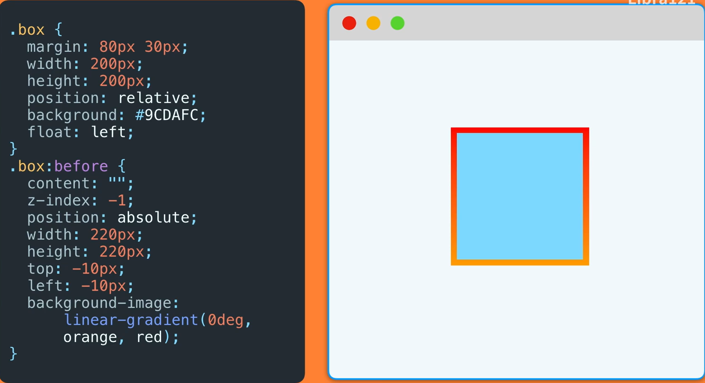