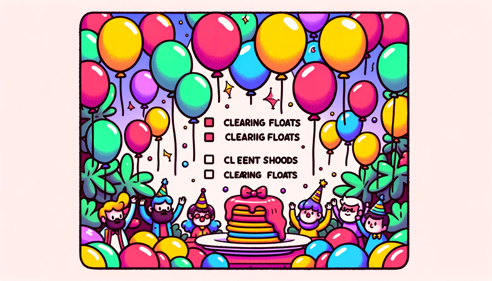

清除浮动是CSS中一个常见的问题。当内部元素浮动时，它脱离了标准的文档流，从而父元素会塌缩，不占据应有的高度。为了解决这个问题，我们需要清除浮动。下面是一些常见的清除浮动的方法：

### 1. 使用额外标签
通过在浮动元素后面添加一个空的标签，并给它添加 `clear: both;` 的样式来清除浮动。

```html
<div class="float"></div>
<div class="clear"></div>
```
```css
.clear {
    clear: both;
}
```

### 2. 使用伪元素
通过在浮动元素的父元素上添加一个伪元素来清除浮动，这样就不需要在HTML中添加额外的标签。

```css
.clearfix::after {
    content: "";
    display: block;
    clear: both;
}
```

### 3. 使用 overflow 属性
将浮动元素的父元素的 `overflow` 属性设置为 `auto` 或 `hidden`，这将创建一个新的BFC（块格式化上下文）并清除浮动。

```css
.container {
    overflow: auto;
}
```

### 4. 使用 flex 布局
通过将浮动元素的父元素设置为弹性布局，可以使得父元素能够包裹浮动的子元素，从而不会发生高度塌陷。

```css
.container {
    display: flex;
}
```

### 5. 使用 grid 布局
与 flex 布局相似，使用 grid 布局的父元素也能够自动清除子元素的浮动。

```css
.container {
    display: grid;
}
```

每种方法都有其适用的场景，可以根据具体的布局需求来选择合适的清除浮动的方法。希望这些方法能够帮助你在实际项目中解决问题！

***

## 🎈漂浮的气球与5种找回方法🎈



🏠 **场景设定**: 假设我们在一个有趣的生日派对现场，有各种各样漂浮在空中的气球🎈。这些气球就像是浮动的元素，他们从地面（常规文档流）脱离，自由飘动。

👀 **问题**: 但现在，我们需要让这些气球停下来，也就是我们的"清除浮动"。

### 1. 🎏 使用额外的风筝线
* _解析_: 当气球飘起来，我们使用一条风筝线（额外的标签）将它们系住。
    ```css
    .extra-line {
        clear: both;
    }
    ```
    
### 2. 🧚 使用精灵的魔法
* _解析_: 精灵（伪元素）轻轻一挥魔杖，用不可见的魔法线（::after伪元素）系住了气球。
    ```css
    .sprite-magic::after {
        content: "";
        display: block;
        clear: both;
    }
    ```
    
### 3. 🌀 创造一个封闭的旋风
* _解析_: 我们用一个强大的旋风（overflow属性）包裹住所有的气球，它们无法飞出旋风的范围。
    ```css
    .whirlwind {
        overflow: auto;
    }
    ```
    
### 4. 🎪 用杂技飞人的力量
* _解析_: 杂技飞人（flex布局）展示了他强大的力量，用他的弹性体操带子（flex属性）将气球包围，任凭它们如何飘动，始终在他的掌控之中。
    ```css
    .acrobatic-flyer {
        display: flex;
    }
    ```
    
### 5. 🏗 使用神秘的悬浮网
* _解析_: 我们使用一个神秘的悬浮网（grid布局）把所有气球统统网住，任它们怎么飘，始终不出网的范围。
    ```css
    .mysterious-net {
        display: grid;
    }
    ```
    
在这个充满趣味的比喻中，气球的漂浮和清除浮动的方法就变得形象和直观。希望这个生动的故事能帮助初学者更轻松地理解清除浮动的各种方法！🎉🚀