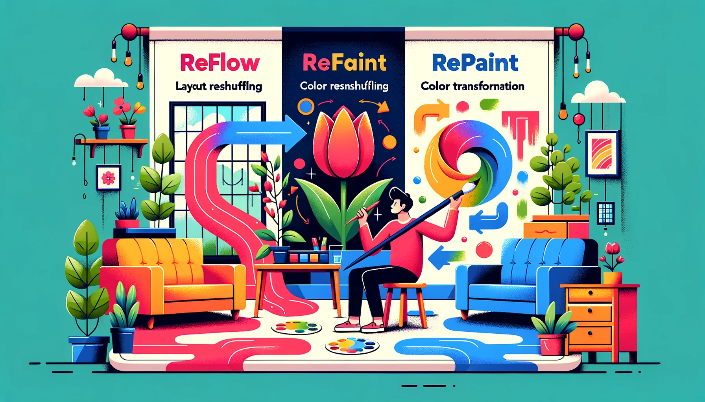

在浏览器的渲染过程中，`重绘`（Repaint）和`重排`（Reflow，有时也被称为`布局`或`回流`）是两个常见的概念。这两者都会影响页面的渲染性能，但它们之间存在明显的区别：

1. **重排 (Reflow)**:
   - 当元素的**几何属性**（如宽度、高度、位置等）发生变化时，浏览器需要重新计算元素的位置和大小，这个过程称为重排。
   - 重排是一个昂贵的操作，因为它可能会影响到页面上的其他元素。当一个元素的尺寸发生变化时，它可能会影响到其周围的元素，导致它们也需要重新布局。
   - 引发重排的常见操作包括：改变窗口大小、修改元素的尺寸或位置、添加或删除可见的DOM元素、激活CSS伪类（例如`:hover`）等。

2. **重绘 (Repaint)**:
   - 当元素的**视觉属性**（如颜色、背景等）发生变化，但没有改变布局时，浏览器需要重新绘制元素，这个过程称为重绘。
   - 与重排不同，重绘不涉及元素的布局计算，所以通常来说，重绘的代价比重排低。
   - 引发重绘的常见操作包括：修改元素的颜色、设置元素的`visibility`属性等。

**重要的是**：重排总是伴随着重绘，因为当元素的布局发生变化时，其外观也需要重新绘制。但重绘并不总是伴随着重排。

为了提高页面的渲染性能，通常建议尽量减少重排和重绘的次数。例如，如果需要修改多个样式属性，可以考虑使用`style.cssText`或将元素从DOM中移除，进行修改后再插入，以此来避免多次重排。

***

### 追问：Android的View中有没有类似重排和重绘的方法？

在Android的`View`系统中，确实存在与Web中的重排和重绘类似的概念。以下是相关的方法和概念：

1. **重排 (Layout) 在Android中的等效**：
   - `requestLayout()`: 当一个`View`或其子`View`的尺寸或位置需要改变时，通常会调用此方法。这会使得在下一个绘制周期中，系统对该`View`及其子`View`进行重新布局（measure和layout过程）。
   - `onMeasure()` 和 `onLayout()`: 这两个方法在`View`的布局过程中被调用。`onMeasure()`确定`View`的尺寸，而`onLayout()`确定子`View`的位置。

2. **重绘 (Paint) 在Android中的等效**：
   - `invalidate()`: 当`View`的内容需要重绘时，会调用此方法。这并不会引发重新布局，而只是触发`View`的`onDraw()`方法在下一个绘制周期中被调用。
   - `onDraw()`: 此方法在`View`的绘制过程中被调用，用于绘制`View`的内容。

对于Android的`View`系统，避免不必要的布局和绘制同样很重要，因为这可以帮助提高应用的性能，特别是在滚动、动画或其他高频更新的场景中。当对`View`的外观或位置进行更改时，应始终考虑使用最少的方法调用来完成任务，以减少CPU和GPU的工作负载。

***
## 🖌️🎨艺术家的画室：CSS重排与重绘的奇妙世界🌈🚪

想象一下，你进入了一位艺术家的画室。这位艺术家非常独特——他使用一个神奇的画布，一旦他决定改变某个部分的设计，整个画布可能都会受到影响。

### 🖼️画布的变化：重排 (Reflow)
👨‍🎨艺术家决定移动画布上的一个大型物体（比如一个巨大的花瓶）到画布的另一边。为了做到这一点，他可能需要移动或者重新安排周围的其他物体，以确保新的布局看起来和谐并且元素之间的空间分配得当。整个画室的布局都发生了变化！

>_重排类似于艺术家重新安排画布上的物体。在CSS的上下文中，当你修改元素的布局属性（如宽度、高度、左侧或顶部的位置等）时，浏览器需要重新计算元素的位置和几何形状，也就是发生了重排。它可能会影响到画布（网页）的多个部分，需要重新计算和渲染整个页面，通常比较消耗性能。_

### 🎨颜色的变幻：重绘 (Repaint)
👩‍🎨此时，艺术家决定改变画布上某个物体的颜色——比如将一朵黄色的郁金香改成红色。这并不会影响到其他物体的位置或整个画室的布局，但画布上的这一部分需要用新的颜色重新上色。

>_重绘是当元素的视觉外观发生变化，但并不影响布局的时候发生的，比如改变颜色、阴影等属性。相比重排，它通常性能开销较小，因为不需要重新计算元素的位置或几何形状。_

### 总结
所以，我们可以这样理解：🚪**重排就像是整个画室的重新布局，可能牵一发而动全身**；🎨**而重绘则更加轻盈，只是轻轻地在原有的基础上换上了新的“颜色”**。在优化网站性能的时候，我们通常要尽可能减少重排和重绘的发生，使得艺术家的工作更加轻松并且画面呈现更加流畅。🌟🖥️🚀