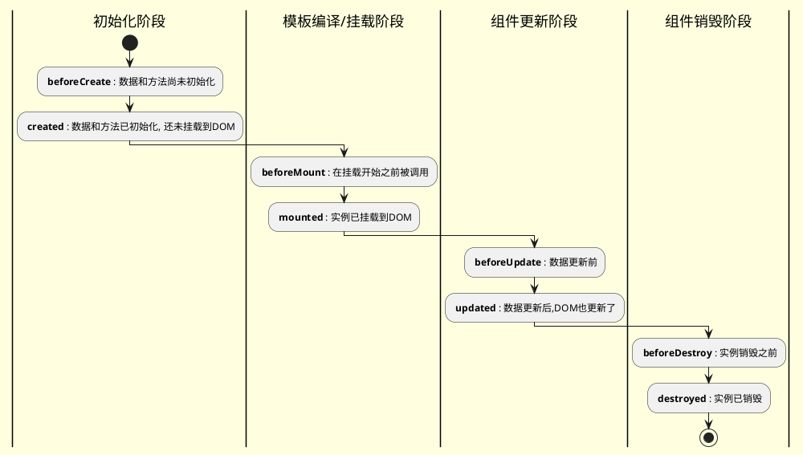

Vue 2 的生命周期主要包括以下几个钩子函数：

1. **beforeCreate**
   在实例初始化之后，数据观测 (data observer) 和 event/watcher 事件配置之前被调用。

2. **created**
   在实例创建完成后被立即调用。在这一步，实例已完成以下的配置：数据观测 (data observer)，属性和方法的运算，watch/event 事件回调。然而，挂载阶段还没开始，`$el` 属性目前不可见。

3. **beforeMount**
   在挂载开始之前被调用：相关的 `render` 函数首次被调用。

4. **mounted**
   实例被挂载后调用。在这一步，实例已经被挂载到它创建时传入的挂载点上。

5. **beforeUpdate**
   数据更新时调用，发生在虚拟 DOM 打补丁前。

6. **updated**
   在数据更改导致的虚拟 DOM 重新渲染和打补丁之后调用。

7. **beforeDestroy**
   实例销毁之前调用。在这一步，实例仍然完全可用。

8. **destroyed**
   Vue 实例销毁后调用。

以下是每个生命周期钩子的概览：

- **初始化阶段**：
  - `beforeCreate`: 组件实例刚在内存被创建出来，此时，还没有初始化好 `data` 和 `methods` 属性。
  - `created`: 组件实例已经完全创建出来，属性已经绑定，但真实 `dom` 还没有生成，`$el` 还不可用。

- **模板编译/挂载阶段**：
  - `beforeMount`: 挂载之前。
  - `mounted`: 挂载到页面中。

- **组件更新阶段**：
  - `beforeUpdate`: 组件更新之前。
  - `updated`: 组件更新之后。

- **组件销毁阶段**：
  - `beforeDestroy`: 组件销毁前。
  - `destroyed`: 组件销毁后。

在使用生命周期钩子函数时，它们提供了我们在不同阶段控制或执行特定逻辑的能力（比如在 `mounted` 钩子里，我们通常执行那些需要依赖 DOM 的操作，因为在这个阶段，我们可以确定 DOM 已经挂载完成）。在实际开发过程中合理利用这些生命周期钩子是非常重要的。