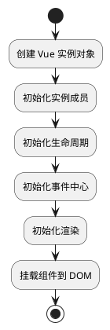

`new Vue()` 的过程涉及到 Vue 实例的创建和初始化，主要分为以下几个关键步骤：



### 1. 实例化
当我们使用 `new Vue()` 创建一个 Vue 的实例时，Vue 会通过构造函数来创建一个新的 Vue 实例。

```javascript
function Vue (options) {
  // ...省略一些代码
  this._init(options)
}
```

### 2. 初始化
在 `_init` 方法中，Vue 会进行一系列的初始化操作，主要包括：
- 合并选项：将全局配置选项和实例的局部配置合并到一个最终的选项对象中。
- 初始化生命周期：在实例内部设置各种生命周期标志，比如是否已挂载等。
- 初始化事件：设置事件监听，并将父组件传来的监听事件保存起来。
- 初始化渲染：创建一个 `VNode` 的虚拟节点，并设置 `$el` 属性。
- 调用 `beforeCreate` 生命周期钩子。
- 初始化 `inject` 选项（如果使用了 `provide/inject` 机制的话）。
- 调用数据响应式的逻辑，使得我们后续的数据变化可以自动触发视图更新。
- 初始化 `provide` 选项（如果使用了 `provide/inject` 机制的话）。
- 调用 `created` 生命周期钩子。

### 3. 挂载
接下来，如果在选项中有 `el` 选项，则调用 `$mount` 方法来挂载 Vue 实例，若没有则待到调用实例的 `$mount` 方法时进行挂载。

```javascript
if (vm.$options.el) {
  vm.$mount(vm.$options.el);
}
```

在 `$mount` 中会发生以下事情：
- 如果存在 `render` 函数，则直接调用 `mountComponent` 进行挂载。
- 如果不存在 `render` 函数，但存在 `template` 选项，则将 `template` 转换为 `render` 函数。
- 如果即不存在 `render` 函数，也不存在 `template` 选项，则将外部 HTML 代码（el 对应的 DOM 节点的 `outerHTML`）转换为 `render` 函数。
- 调用 `beforeMount` 生命周期钩子。
- 创建 `Watcher` 实例，它会触发 `Vue` 的渲染逻辑。
- 触发首次渲染，生成真正的 DOM，并替换挂载的元素。
- 调用 `mounted` 生命周期钩子。

### 4. 渲染
在渲染阶段，Vue 会通过调用 `render` 函数生成虚拟 DOM，再将虚拟 DOM 转化为真实 DOM，并更新到页面上。

### 5. 更新 & 卸载
之后，在应用的运行过程中，一旦检测到数据变化，Vue 会重新触发更新逻辑，对比虚拟 DOM 的变化，并按需更新到真实 DOM 中。当 Vue 实例销毁时，会进行卸载操作，解除绑定的事件、监听、观察者等，调用 `beforeDestroy` 和 `destroyed` 生命周期钩子，并进行必要的清理工作。

总结来说，`new Vue()` 的过程大致涉及到实例的创建、初始化、挂载、渲染，以及后续可能的更新和卸载过程。在此过程中，Vue 实例会经历不同的生命周期，开发者可以利用生命周期钩子来在这些关键节点执行自己的逻辑。