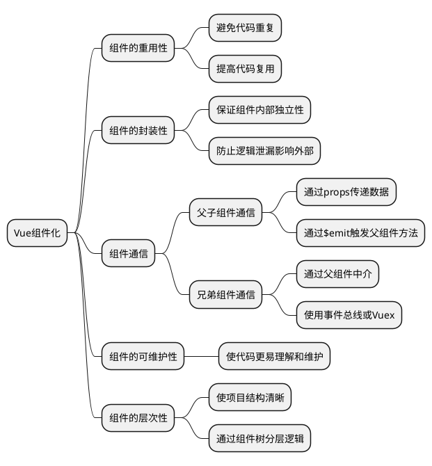

Vue.js 的组件系统提供了一种抽象，让我们可以使用独立可复用的小组件来构建大型应用。在较高层面上，组件化是 Vue.js 用来提高前端开发效率和可维护性的重要机制。下面是我对 Vue 组件化的一些理解：



### 1. **组件的重用性**
- **目的：** 避免代码重复，提高代码复用。
- **实现：** 通过将通用功能提取到单独的组件中，可以在多处调用同一组件，减少代码的重复性。

### 2. **组件的封装性**
- **目的：** 保证组件内部的独立性，防止内部逻辑泄漏影响外部环境。
- **实现：** Vue 组件将HTML、JavaScript、CSS 封装在一起，确保组件内部的状态和逻辑不会影响到其他部分，组件的内部逻辑可以自由修改而不影响外部使用。

### 3. **组件通信**
- **目的：** 让组件能够互相传递数据和消息，以便合作完成复杂功能。
- **实现：**
  - **父子组件通信：** 通过 props 进行父子之间的数据传递，通过 `$emit` 触发父组件的方法，或者通过 `$refs` 访问子组件的属性和方法。
  - **兄弟组件通信：** 可以通过共同的父组件作为中介，或者使用事件总线、Vuex 等技术进行状态管理和通信。

### 4. **组件的可维护性**
- **目的：** 使代码更易理解和维护。
- **实现：** 将功能划分到不同的组件中，每个组件只关心自己的逻辑和样式，便于团队协作和后期维护。

### 5. **组件的层次性**
- **目的：** 使项目结构更清晰。
- **实现：** Vue 允许我们通过组件嵌套的方式来组织我们的界面，组件树结构使项目结构分层清晰，逻辑明确。

### 示例代码

以一个简单的“按钮”组件为例：

```html
<template>
  <button @click="clickHandler">{{ label }}</button>
</template>

<script>
export default {
  props: {
    label: {
      type: String,
      default: 'Button'
    }
  },
  methods: {
    clickHandler() {
      this.$emit('button-clicked');
    }
  }
}
</script>

<style scoped>
button {
  /* some CSS styles */
}
</style>
```

在这个组件中：
- `template` 封装了组件的 HTML 结构。
- `script` 封装了组件的逻辑。
- `style` 封装了组件的样式，并通过 `scoped` 确保样式只作用于当前组件。

组件化提供了一种将用户界面划分为独立、可复用单元的方式，并允许我们用类似于搭积木的方式构建应用，大大提升了前端开发的效率和可维护性。希望这些理解对你有帮助！