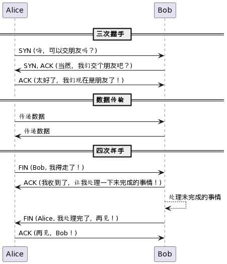

# TCP的三次握手和四次挥手

## 前置知识

### SYN包（客）

Synchronize（同步），客户端发送的同步请求。

### ACK+SYN包（服）

服务器回复的同步确认。

### FIN包（客/服）

Finish（结束），发起方（可以是客户端或服务器）发送的终止连接请求。

### ACK包（客/服）

Acknowledgement（确认），对FIN包的确认。

## 概述版

三次握手是建立连接时，客户端发送SYN，服务器回复SYN+ACK，客户端再回复ACK确认。

四次挥手是关闭连接时，客户端发送FIN，服务器回复ACK，服务器发送FIN，客户端回复ACK确认。

### 比喻法 - 🤝 **交朋友的协议：TCP握手与挥手**

**三次握手**🤝：
1. 🙋‍♂️ Alice（客户端）问Bob（服务器）：“嗨，可以交朋友吗？”（SYN）
2. 🤷‍♂️ Bob回答：“当然，我们交个朋友吧？”（SYN, ACK）
3. 🤗 Alice说：“太好了，我们现在是朋友了！”（ACK）

他们成为了朋友并开始互相交流（数据传输）🗣️。

**四次挥手**👋：
1. 🚶‍♂️ Alice：“Bob, 我得走了！”（FIN）
2. 🙆‍♂️ Bob：“我收到了，让我处理一下未完成的事情！”（ACK）
3. ⌛ Bob处理未完成的事情...
4. 👋 Bob：“Alice, 我处理完了，再见！”（FIN）
5. 🤗 Alice：“再见，Bob！”（ACK）

现在，他们礼貌地结束了他们的对话🔚。

## 详述版

TCP（传输控制协议）是一种可靠的、面向连接的协议，用于在网络中的计算机之间传输数据。在传输数据之前，TCP 需要在两台计算机之间建立一个可靠的连接。为了实现这个连接，TCP 使用了一个被称为“三次握手”（3-Way Handshake）的过程。而在数据传输完成后，为了优雅地终止这个连接，TCP 则执行一个“四次挥手”（4-Way Handshake）的过程。下面简要解释这两个过程：

### TCP 三次握手（建立连接）

1. **SYN**：客户端发送一个 SYN（synchronize） 包到服务器，以请求一个新的连接。这个包包含一个随机的序列号 A。
2. **SYN + ACK**：服务器收到 SYN 包后，确认连接请求，并返回一个 SYN + ACK（acknowledge） 包。这个包包含自己的一个随机序列号 B 和对客户端序列号 A 的确认（A+1）。
3. **ACK**：客户端收到 SYN + ACK 包后，再发送一个 ACK 包给服务器，确认服务器的序列号 B。

### TCP 四次挥手（终止连接）

1. **FIN**：当传输结束后，发送方发送一个 FIN（finish） 包，通知接收方它已经完成了数据的发送。
2. **ACK**：接收方收到 FIN 包后，返回一个 ACK 包作为响应，通知发送方已经收到了关闭请求。
3. **FIN**：当接收方已经无更多数据要发送时，也发送一个 FIN 包给发送方，表明它也准备好关闭连接了。
4. **ACK**：发送方收到 FIN 包后，返回一个 ACK 包，确认已经收到接收方的关闭请求。然后连接终止。

简单来说，三次握手主要确保两方都有能力发送和接收数据，保证通信的双方互相同步。四次挥手则确保数据完全发送完毕，并且能够优雅地关闭连接。在网络通信中，这两个过程分别保证了TCP连接的建立与终止的可靠性。