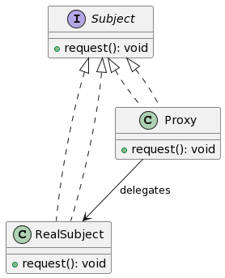

# 代理模式

**代理模式**为其他对象提供一个**代理**或占位符，以控制对原对象的**访问**。



1. Subject 是一个接口，定义了RealSubject 和 Proxy 都需要实现的通用操作。
2. RealSubject 是主题接口的真实实现。
3. Proxy 保存一个引用使得代理可以访问实际的 RealSubject，并提供一个与 Subject 的接口相同的方法 request。这个方法会在调用 RealSubject 之前或之后执行一些附加操作。

## 🎤 歌手与经纪人 🕴️

想象你是一个粉丝，想要邀请你最喜欢的歌手到你的生日派对上表演。但你不能直接与歌手联系，需要通过她的经纪人来安排。

在这里，**歌手**是真正执行工作的对象，而**经纪人**则是她的代理。经纪人会处理与外界的所有交互，如协商价格、安排时间等，然后决定是否让歌手出场。

- 🎵 **歌手**就是**RealSubject**。
  > _她是真正执行请求的对象，例如在派对上唱歌。_

- 🕴️ **经纪人**就是**Proxy**。
  > _他控制着对歌手的访问，可以在转达请求给歌手之前或之后进行一些操作，如协商价格或检查日程安排。_

通过这个比喻，你可以理解代理模式是如何工作的：代理控制着对原始对象的访问，并可以在需要的时候进行附加操作。🌟

## 示例代码

```javascript
// 代理模式 (Proxy Pattern)

// ① 定义主题接口。这是RealSubject和Proxy都要遵循的约定。
class Singer {
    perform() {
        throw new Error("此方法必须在子类中被重写");
    }
}

// ② 定义RealSubject。这是主题接口的真实实现。
class ActualSinger extends Singer {
    perform() {
        console.log("歌手开始演唱");
    }
}

// ③ 定义Proxy。它保存一个引用使得代理可以访问实际的RealSubject，并提供一个与Singer接口相同的方法perform。
class Manager extends Singer {
    constructor(singer) {
        super();
        this.singer = singer;
    }

    negotiate() {
        console.log("经纪人正在谈判");
        // 伪代码: 如果条件满足则返回true，否则返回false
        return true;
    }

    perform() {
        if (this.negotiate()) {
            console.log("谈判成功，歌手可以表演");
            this.singer.perform();
        } else {
            console.log("谈判失败，歌手不能表演");
        }
    }
}

// 使用示例：

const singer = new ActualSinger();
const singerManager = new Manager(singer);

singerManager.perform();  // 输出: 经纪人正在谈判, 谈判成功，歌手可以表演, 歌手开始演唱

```

总结：代理模式允许一个对象代替另一个对象来控制对它的访问。在这个示例中，经纪人（代理）控制对歌手（真实主题）的访问。当请求需要歌手表演时，经纪人首先进行谈判，然后根据谈判的结果决定是否允许歌手表演。

关键词：主题接口、真实主题、代理、控制访问。