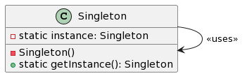

# 单例模式

**单例模式**确保一个类只有一个**实例**，并提供一个全局点来访问这个实例。


- `Singleton` 类含有一个指向自己类型的私有静态成员 `instance`，这用于存储类的唯一实例。
- 构造函数 `Singleton()` 是私有的，这阻止了外部通过 `new` 关键字创建类的新实例。
- `getInstance` 是一个公共的静态方法，它返回类的唯一实例，如果实例不存在，它会先创建一个。

## 🌍 地球：宇宙中的独一无二 🌌

想象我们的宇宙。在这无尽的星海中，只有一个我们称之为“家”的地方——地球。

在这里，**地球**就像是一个单例。尽管宇宙中有无数的星球，但对于我们来说，只有这一个特殊的、独特的“家”。

- 🌍 **地球**代表**单例**。
  > _在整个宇宙中，只有一个我们可以称之为家的地方。_

这个比喻帮助你理解单例模式的核心思想：确保某个类只有一个实例，并提供一个全局访问点。🌟

## 示例代码

```javascript
// 单例模式 (Singleton Pattern)

// ① 定义Singleton类。
class Singleton {
    // ② 在Singleton类内部保持对实例的引用，但不向外部暴露。
    static _instance = null;

    // ③ 构造函数为私有，防止外部通过new关键字创建实例。
    constructor() {
        if (Singleton._instance) {
            throw new Error("已存在Singleton实例，不能再次创建！");
        }
        Singleton._instance = this;
    }

    // ④ 提供一个公开的静态方法来获取Singleton实例。
    static getInstance() {
        if (!Singleton._instance) {
            Singleton._instance = new Singleton();
        }
        return Singleton._instance;
    }
}

// 使用示例：

const instance1 = Singleton.getInstance();
const instance2 = Singleton.getInstance();

console.log(instance1 === instance2);  // 输出: true，证明两个引用都指向同一个实例。

// 以下代码会抛出错误，因为不能直接使用new关键字创建Singleton实例。
// const errorInstance = new Singleton();

```

总结：单例模式确保某个类只有一个实例，并提供一个全局访问点。在这个示例中，我们展示了如何在JS中实现单例模式，并确保不会有多个实例被创建。

关键词：单实例、全局访问点、私有构造函数。